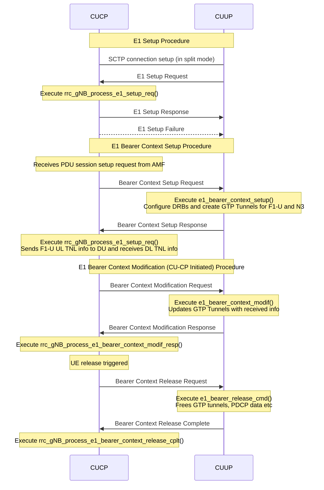
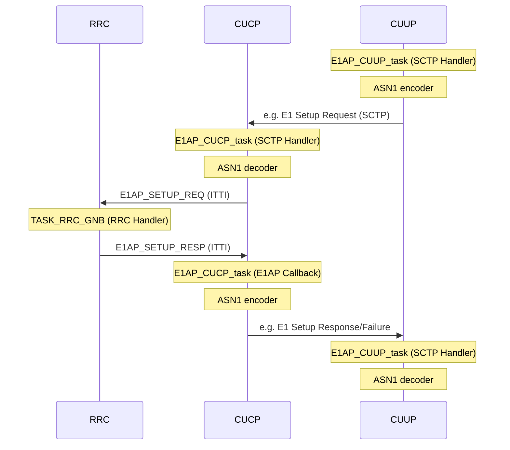

[[_TOC_]]

# 1. Introduction

E1 is the interface that lies between the nodes CU Control Plane (CUCP) and CU User Plane (CUUP). Once the nodes are configured, all user plane traffic flows through CUUP.

The E1 design in OAI follows the 3GPP specification in TS 38.460/463. The code
design on E1 in OAI is very similar to F1: OAI uses E1 internally to set up
bearers, even in monolithic gNB, where the actual "way" the messages are passed
is abstracted through function pointers. More specifically, there are handlers
that handle the E1 messages as shown below, *which are the same* no matter if
the CU is integrated or separate in CU-CP/UP. The below sequence diagram lists
the handlers that are executed and the current E1AP message flow (SCTP
connection setup only in split-mode, the rest is the same for CU):



The implementation of callbacks towards these handlers is distributed across the following file, depending on the operating mode:

| Mode          | CP=>UP messages     |UP=>CP messages     |
| --------------| --------------------|--------------------|
| Integrated CU | `cucp_cuup_direct.c`|`cuup_cucp_direct.c`|
| E1 Split      | `cucp_cuup_e1ap.c`  |`cuup_cucp_e1ap.c`  |

As long as concerns E1 Interface Management Procedures, the code flow of request messages towards northbound looks like this:




# 2. Running the E1 Split

The setup is assuming that all modules are running on the same machine. The user can refer to the [F1 design document](./F1-design.md) for local deployment of the DU.

## 2.1 Configuration File

The gNB is started based on the node type that is specified in the configuration file. The following parameters must be configured accordingly.

On either CUCP and CUUP:
* The southbound transport preference `gNBs.[0].tr_s_preference` set to `f1`
* config section `E1_INTERFACE` should be present

On the CU-CP:
* `type` parameter within the `E1_INTERFACE` should be set to `cp`

On the CU-UP:
* `type` parameter within the `E1_INTERFACE` should be set to `up`

Executables:
* executable `nr-softmodem` to run a CU-CP
* executable `nr-cuup` to run the CU-UP

In the `E1_INTERFACE` configuration section, the parameters `ipv4_cucp` and `ipv4_cuup` must be configured to specify the IP addresses of the respective network functions.

For CUCP, a typical `E1_INTERFACE` config looks like:
```
E1_INTERFACE =
(
  {
    type = "cp";
    ipv4_cucp = "127.0.0.4";
    ipv4_cuup = "127.0.0.5";
  }
)
```

For CUUP, it is:
```
E1_INTERFACE =
(
  {
    type = "up";
    ipv4_cucp = "127.0.0.4";
    ipv4_cuup = "127.0.0.5";
  }
)
```
One could take an existing CU configuration file and add the above parameters to run the gNB as CUCP or CUUP.

The CUUP uses the IP address specified in `gNBs.[0].local_s_address` for F1-U and `GNB_IPV4_ADDRESS_FOR_NGU` for N3 links. Note that `local_s_address` is under `gNBs` and `GNB_IPV4_ADDRESS_FOR_NGU` is part of the `NETWORK_INTERFACES` config member.

Alternatively, you can use the config files `ci-scripts/conf_files/gnb-cucp.sa.f1.conf` and `ci-scripts/conf_files/gnb-cuup.sa.f1.conf`.

## 2.2 Steps to Run the Split in rfsimulator with OAI UE

Note: A 5G core must be running at this point. Steps to start the OAI 5G core can be found [in the oai-cn5g-fed repository](https://gitlab.eurecom.fr/oai/cn5g/oai-cn5g-fed/-/blob/master/docs/DEPLOY_HOME.md) or [here](NR_SA_CN5G_gNB_USRP_COTS_UE_Tutorial.md).

0. Open wireshark to capture the E1AP messages. You might set the capture filter
   to `sctp` to limit the number of captured packages.

1. Start the CUCP first by running the following command
```
sudo ./nr-softmodem -O ../../../ci-scripts/conf_files/gnb-cucp.sa.f1.conf --gNBs.[0].min_rxtxtime 6 --sa
```

Note that `min_rxtxtime` should be set to `6` only when you are connecting an OAI UE to the gNB.

2. Start the CUUP and DU (in any order)

CUUP (has its own executable):
```
sudo ./nr-cuup -O ../../../ci-scripts/conf_files/gnb-cuup.sa.f1.conf --sa
```

DU:
```
sudo ./nr-softmodem -O ../../../ci-scripts/conf_files/gNB_SA_DU.conf --rfsim --sa
```

You need to use  `--rfsim` if you are running the test with rfsimulator.

3. Start OAI UE or COTS UE.

OAI UE:
```
sudo ./nr-uesoftmodem -r 106 --numerology 1 --band 78 -C 3619200000 --rfsim --sa --rfsimulator.serveraddr 127.0.0.1
```

# 3. Configuration file IP addresses of network functions

You can also run the nodes on different machines. If you do so please change the interface parameters accordingly and make sure the interfaces are reachable. Please refer to the following figure for an overview of all parameters.

{width=1200}

[PDF version](images/e1-archi.pdf) | [LaTeX/TikZ version](img/e1-archi.tex) if you want to modify to reflect your setup

# 4. Multiple CU-UP

It is possible to connect multiple CU-UP to the same CU-CP. In the handler of
the E1 Setup Request, the CU-CP verifies that the PLMN(s) (MCC, MNC) between
both nodes match, and that no CU-UP with the same ID exists. Note that the
NSSAIs for the CU-UPs can be different.

During attach, the following rules are used to select a CU-UP at the CU-CP, in
order:
- Select a CU-UP based on slice identifiers:
  - If both the SST and SD match exactly, that CU-UP is selected. (If multiple
    have the same NSSAI, the first is always selected.)
  - Otherwise, the first CU-UP with the same SST but different SD is selected.
- Round-robin across all CU-UPs.
- The first CU-UP.
- If no CU-UP is selected, the CU-CP asserts.

Note that CU-UPs are not released from CU-CP internal structures. That means
that you have to restart the CU-CP if you want to connect the CU-UP again
(e.g., after a crash). The CU-CP might also misfunction during attach if a
CU-UP was connected, but disconnected in the meantime.
