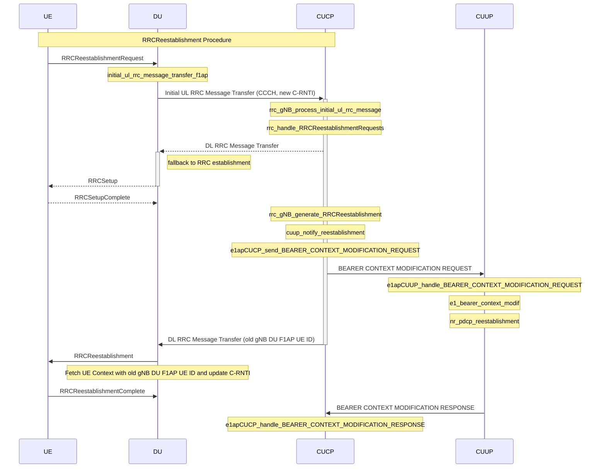

<table style="border-collapse: collapse; border: none;">
  <tr style="border-collapse: collapse; border: none;">
    <td style="border-collapse: collapse; border: none;">
      <a href="http://www.openairinterface.org/">
         
         </img>
      </a>
    </td>
    <td style="border-collapse: collapse; border: none; vertical-align: center;">
      <b>E1AP Procedures</b>
    </td>
  </tr>
</table>

[[_TOC_]]

# Introduction
The E1 interface is between the gNB-CU-CP (Central Unit - Control Plane) and gNB-CU-UP (Central Unit - User Plane) nodes. This interface is governed by the E1 Application Protocol (E1AP) outlined in the 3GPP release 16 specifications, specifically in the documents:
* 3GPP TS 38.463 - E1 Application Protocol (E1AP)
* 3GPP TS 38.460 - E1 general aspects and principles
* 3GPP TS 38.461 - E1 interface: layer 1 
* 3GPP TS 38.462 - E1 interface: signaling transport

The E1AP protocol consists of the following sets of functions:
* E1 Interface Management functions
* E1 Bearer Context Management functions
* TEID allocation function

## E1 Bearer Context Management function
This function handles the establishment, modification, and release of E1 bearer contexts.
* E1 Bearer Context Establishment: initiation of E1 bearer context is by gNB-CU-CP and acceptance or rejection is determined by gNB-CU-UP based on admission control criteria (e.g., resource availability).
* E1 Bearer Context Modification: can be initiated by either gNB-CU-CP or gNB-CU-UP, with the receiving node having the authority to accept or reject the modification.
* Release of Bearer Context: can be triggered either directly by gNB-CU-CP or following a request from gNB-CU-UP.
* QoS-Flow to DRB Mapping Configuration: responsible for setting up and modifying the QoS-flow to DRB mapping configuration. gNB-CU-CP decides the flow-to-DRB mapping, generates SDAP and PDCP configurations, and provides them to gNB-CU-UP.

# OAI implementation

For the E1AP design in OAI, please refer to the [E1 Design](./E1-design.md) document.

## E1 re-establishment

The purpose of this procedure is to follow-up the re-establishment of RRC connection over the E1 interface. For all activated DRBs a Bearer Context Modification from CU-CP to CU-UP is necessary, according to clause 9.2.2.4 of 3GPP TS 38.463. If any modification to the bearer context is required, the CU-CP informs the CU-UP with the relevant IEs (e.g. in case of PDCP re-establishment, PDCP Configuration IE clause 9.3.1.38), Current implementation in OAI:

