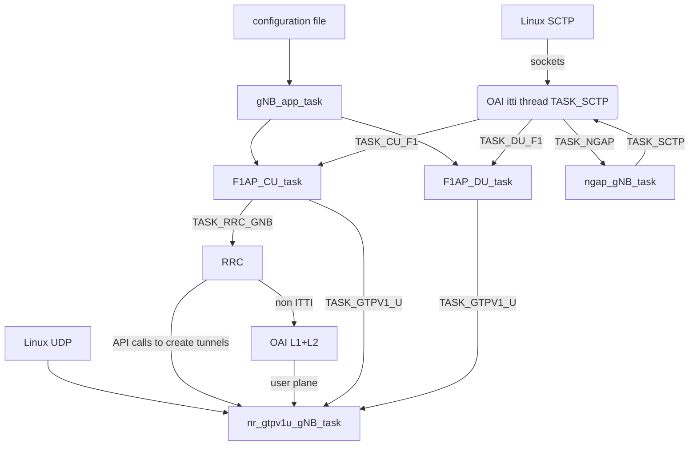

<table style="border-collapse: collapse; border: none;">
  <tr style="border-collapse: collapse; border: none;">
    <td style="border-collapse: collapse; border: none;">
      <a href="http://www.openairinterface.org/">
         
         </img>
      </a>
    </td>
    <td style="border-collapse: collapse; border: none; vertical-align: center;">
      <b>F1 split design</b>
    </td>
  </tr>
</table>
# 1. Introduction

We use OpenAirInterface source code, and it's regular deployment scheme.

F1 specification is in 3GPP documents: TS 38.470 header document and all documents listed in chapter 2 References of TS 38.470.

This document explains how the source code works.

Offered features and deployment instructions are described in: 
https://gitlab.eurecom.fr/oai/openairinterface5g/-/wikis/f1-interface

# 2. Common multi-threading architecture #

The CU and DU interfaces are based on ITTI threads (see oai/common/utils/ocp_itti/itti.md)

All OAI upper layers use the ITTI framework to run isolated threads dedicated to one feature.
The lower layers adopt case by case specific software architecture.

A "task" is a Linux thread running infinite waiting loop on one ITTI queue 

app task manages the initial configuration

sctp task mamanges the SCTP Linux sockets

CU code runs in the task F1AP_CU_task. It stores it's private data context in a static variable. No mutex is used, as the single interface to CU ITTI tast in incoming ITTI messages. CU task is a single ITTI queue, but multiple CU could exist in one Linux process, using the "instance id" (called "module id" also) to create separate contextual information for each CU instance.

DU code runs in the task F1AP_DU_task. The design is similar to CU task

All GTP-U tunnels are managed in a Linux Thread, that have partially ITTI design: 

1. tunnel creation/deletion is by C API functions direct calls (a mutex protects it)
2. outgoing packets are pushed in a ITTI queue to the gtp thread
3. incoming packets are sent to the tunnel creator using a C callback (the callback function is given in tunnel creation order). The callback should not block

# 3. CU F1AP messages  #

## startup

CU thread starts when the CU starts. It opens listening socket on F1AP_PORT_NUMBER by sending the appropriate message to TASK_SCTP.

It will accept the first incoming connection on this port

## F1 SETUP

DU has connected, and sent this message.

The CU receives, decode it and send relevant information to RRC thread by message F1AP_SETUP_REQ

## F1 SETUP response

RRC sends two messages to CU F1 task: the information to encode the F1 setup response and a second message to encode F1AP_GNB_CU_CONFIGURATION_UPDATE

Upon reception of these two messages the CU task encodes and sends the messages to the DU

## UE entry

When CCH channel decoding finds a new UE identity, it call rrc_gNB_generate_RRCSetup() that will send F1AP_DL_RRC_MESSAGE to the CU task.

The CU encodes and sends to DU DLRRCMessageTransfer

## UE attach/detach

When rrc_gNB_process_RRCReconfigurationComplete() occurs, the RRC sends to CU task the message F1AP_UE_CONTEXT_SETUP_REQ. The CU task encodes the F1 message UEContextSetup and send it to the DU over F1AP.

This function rrc_gNB_process_RRCReconfigurationComplete() also creates the GTP-U user plane bearers.

## F1AP incoming messages

SCTP tasks sends a ITTI message  SCTP_DATA_IND to the CU task.

A array of functions pointers and the F1AP standard identifier "procedureCode", the CU calls the appropriate function

Hereafter the most significant messages processing

### CU_handle_F1_SETUP_REQUEST

Transcodes information to the same message toward RRC (F1AP_SETUP_REQ)

### CU_handle_INITIAL_UL_RRC_MESSAGE_TRANSFER

Transcodes information to the same message toward RRC (NR_RRC_MAC_CCCH_DATA_IND)

### CU_handle_UL_RRC_MESSAGE_TRANSFER

Encode and send data to PDCP  (calling pdcp_data_ind ()) for processing UL data.

# DU F1 Messages

## Startup

The task "gNB app" after rzading the configuration file, sends a first message F1AP_SETUP_REQ to DU task

Using this message, the uniq DU task (Linux Thread) creates a DU instance context memory space, calls SCTP task to create a socket to the CU.

When it receives from the SCTP task the socket creation success, the DU task encodes+sends the F1 setup message to the CU.

## F1AP_INITIAL_UL_RRC_MESSAGE

When MAC layer push UL data to DU task, the DU sends to CU the message InitialULRRCMessageTransfer

## F1AP_UL_RRC_MESSAGE

In case of SRB bearer, the RLC layer use this message to push rlc bearer payload to DU task, that forward to CU

## pdcp_data_ind

This function call in RLC, when it is a DRB will be replaced by F1-U transport to CU

## F1AP incoming messages

SCTP tasks sends a ITTI message  SCTP_DATA_IND to the DU task.

A array of functions pointers and the F1AP standard identifier "procedureCode", the DU calls the appropriate function

Hereafter the most significant messages processing

### DU_send_F1_SETUP_RESPONSE

Decode the CU message, then encode a message to TASK_GNB_APP. The thread "APP" extracts the system information block and reconfigure the DU with: du_extract_and_decode_SI(), configure_gnb_du_mac()

### DU_handle_gNB_CU_CONFIGURATION_UPDATE

No developped

### DU_handle_UE_CONTEXT_SETUP_REQUEST

Push data to RLC layer for transmisstion in DL (to the UE) by calling enqueue_rlc_data_req()

### DU_handle_DL_RRC_MESSAGE_TRANSFER

Depending on the content, adds UE context in DU low layers and/or send data to the UE with rlc_data_req()

# F1-U messages 

To be completed
