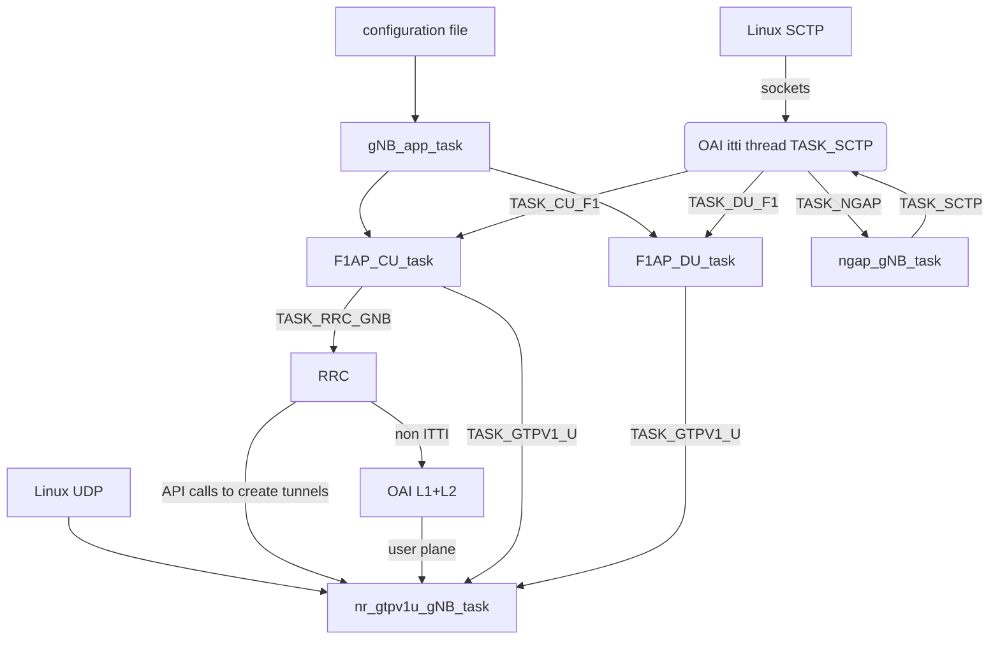

<table style="border-collapse: collapse; border: none;">
  <tr style="border-collapse: collapse; border: none;">
    <td style="border-collapse: collapse; border: none;">
      <a href="http://www.openairinterface.org/">
         
         </img>
      </a>
    </td>
    <td style="border-collapse: collapse; border: none; vertical-align: center;">
      <b><font size = "5">F1 split design</font></b>
    </td>
  </tr>
</table>

[[_TOC_]]

# Introduction

The F1 interface is the functional split of 3GPP between the CU (centralized
unit: PDCP, RRC, SDAP) and the DU (distributed unit: RLC, MAC, PHY). It is
standardized in TS 38.470 - 38.473 for 5G NR. No equivalent for 4G exists.

We assume that each DU handles only one cell. Multiple DUs connected to one CU
are supported. Mobility over F1 is not yet supported.

# Control plane status (F1-C)

## Implementation Status

Note that OAI uses F1 "internally". That means, that even **if you run a
monolithic gNB, the internal information exchange uses F1**. You can therefore
expect that everything working in a monolithic deployment should also work in
F1.  The current implementation is based on R16.3.

Note that NSA does NOT follow this logic yet, and does not work with F1.

The following messages are currently implemented:

- F1 Setup Request and F1 Setup Response/Failure
- Initial UL RRC, UL/DL RRC Message Transfer
- F1 UE Context management messages for the "good case"
  * Setup Request/Response
  * Modification Request/Response
  * Release Request/Command/Complete

All other messages are not implemented or not working reliably:

- F1 CU/DU configuration updade
- Paging messages
- Warning Message transmissions

## High-level F1-C code structure

The F1 interface is used internally between CU (mostly RRC) and DU (mostly MAC)
to exchange information. In DL, the CU sends messages as defined by the
callbacks in `mac_rrc_dl.h`, whose implementation is defined in files
`mac_rrc_dl_direct.c` (monolithic) and `mac_rrc_dl_f1ap.c` (for F1AP). In the
monolithic case, the RRC calls directly into the message handler on the DU side
(`mac_rrc_dl_handler.c`). In the F1 case, an ITTI message is sent to the CU
task, sending an ASN.1-encoded F1AP message. The DU side's DU task decodes the
message, and then calls the corresponding handler in `mac_rrc_dl_handler.c`.
Thus, the message flow is the same in both F1 and monolithic cases, with the
difference that F1AP encodes the messages using ASN.1 and sends over a socket.

In UL, the callbacks defined in `mac_rrc_ul.h` are implemented by
`mac_rrc_ul_direct.c` (monolithic) and `mac_rrc_ul_f1ap.c` (F1). In the direct
case, an ITTI message is directly sent to the RRC task (hence, there is no
dedicated handler). In F1, the DU task receives the ITTI message, encodes using
ASN.1, and sends it over a network socket.  The CU task decodes, and sends the
same ITTI message to the RRC task as done directly in the monolithic case.

```
                             +-------------+
                             |             |
                             |   CU/RRC    |
                             |             |
                             +-------------+
                                |       ^
     Callback def: mac_rrc_dl.h |       | No handler needed:
     F1 impl: mac_rrc_dl_f1ap.c |       | RRC has ITTI
Monolithic: mac_rrc_dl_direct.c |       |
                                |       |
                             DL |       | UL
                                |       |
                                |       | Callback def: mac_rrc_ul.h
               Message handler: |       | F1 impl: mac_rrc_ul_f1ap.c
           mac_rrc_dl_handler.c |       | Monolithic: mac_rrc_ul_direct.c
                                v       |
                             +-------------+
                             |             |
                             |   DU/MAC    |
                             |             |
                             +-------------+
```

# Data plane status (F1-U)

F1-U uses GTP-U for information exchange. The GTP protocol uses some extensions
for NR-U protocol to report buffer status, but this is not properly tested and
might malfunction. One limitation is that the current implementation
acknowledges each packet individually.

Multiple DUs at one CU are supported in the data plane (as in the control plane).

# How to run

As mentioned earlier, OAI uses F1 internally. It is always compiled in.
To start CU/DU, you use `./nr-softmodem` with the appropriate configuration
files, for instance:

```
sudo cmake_targets/ran_build/build/nr-softmodem --sa -O ci-scripts/conf_files/gnb-cu.sa.band78.106prb.conf
sudo cmake_targets/ran_build/build/nr-softmodem --sa -O ci-scripts/conf_files/gnb-du.sa.band78.106prb.rfsim.conf
```

These files are tested in the CI, and are configured for use in docker,
see [this `docker-compose` file](../ci-scripts/yaml_files/5g_f1_rfsimulator/docker-compose.yaml).

The rules to decide if a config triggers a start of a DU, CU, or monolithic
gNB, are, in order:
1. If the `MACRLCs` section lists `f1` as **northbound transport preference**
   (`tr_n_preference`), it is a DU.
2. If the `gNBs` section lists `f1` as a **southound transport preference**
   (`tr_s_preference`), it is a CU.
3. It is a (monolithic) gNB.

## Local network deployment of F1

For a local deployment, you should update the following fields.
We assume that the CU will bind on `192.168.70.129` towards the core,
`127.0.0.3` towards the DU, and the DU `127.0.0.4` towards the CU.

In the CU file:
- Update the `gNBs.[0].amf_ip_address` and `gNBs.[0].NETWORK_INTERFACES`
  section towards the core (typically, OAI CN is configured to provide a docker
  bridge on `192.168.70.129` and the AMF is on `192.168.70.132`):
  - `gNBs.[0].amf_ip_address.[0].ipv4 192.168.70.132`
  - `gNBs.[0].NETWORK_INTERFACES.GNB_IPV4_ADDRESS_FOR_NG_AMF 192.168.70.129`
  - `gNBs.[0].NETWORK_INTERFACES.GNB_IPV4_ADDRESS_FOR_NGU 192.168.70.132`
- Set `gNBs.[0].tr_s_preference` (transport south-bound) to `f1`
- Update the `gNBs.[0].local_s_address` (CU-local south address) for the F1-C
  south-bound interface: `127.0.0.3`
- Note: the `gNBs.[0].remote_s_address` (CU-remote/DU south address) is
  ignored, but we recommend to put `0.0.0.0` ("any")
- Ports should match the ones in the DU config, but for simplicity and
  standards-conformity, simply set all to 2152:
  - `local_s_portc` in CU should match `remote_n_portc` in DU
  - `local_s_portd` in CU should match `remote_n_portd` in DU
  - `remote_s_portc` in CU should match `local_n_portc` in DU
  - `remote_s_portd` in CU should match `local_n_portd` in DU

In the DU file:
- Set `MACRLCs.[0].tr_n_preference` to `f1`
- Update `MACRLCs.[0].local_n_address` (local north-bound address of the DU) to
  `127.0.0.4`. This IP address is used to bind the GTP socket (F1-U user plane
  traffic).
- Update `MACRLCs.[].remote_n_address` (remote north-bound address of the CU)
  to `127.0.0.3`. This IP address is used as the CU destination IP address for
  F1AP communication.

Note: all `local_*_if_name` parameters are ignored.

## Configuration of multiple DUs

Upon F1 Setup Request of a new DU, the CU cross-checks that

- no DUs have the same gNB-DU IDs, taken from `gNBs.[0].gNB_ID`, and
- no cells have the same NR Cell ID, taken from `gNBs.[0].nr_cellid`, and
- no cells have the same physical cell IDs, taken from `gNBs.[0].servingCellConfigCommon.[0].physCellId`.

If any of these are the same, the CU will reject the DU with an F1 Setup
Failure. Thus, you should make sure that in the DU's configs, these parameters
are set differently.

You have to of course make sure that the local interface of the DU
(`MACRLCs.[0].local_n_address`) is different as well.

Assuming you use RFsim, you should make the RFsimulator server side (typically
the gNB) bind on different hosts (`rfsimulator.serverport`).

# Code documentation

## Common multi-threading architecture

The CU and DU interfaces are based on ITTI threads (see `common/utils/ocp_itti/itti.md`)
adopted by all OAI upper layers to run isolated threads dedicated to one feature.



A "task" is a Linux thread running an infinite waiting loop on one ITTI queue.

The `app` task manages the initial configuration; the `sctp` task manages the
SCTP Linux sockets.

The CU encoding/decoding runs in the task executing `F1AP_CU_task()`. It stores its private data context in a static variable.
The DU encoding/decoding runs in the task executing `F1AP_DU_task()`. The design is similar to CU task.

All GTP-U tunnels are managed in a Linux Thread, that have partially ITTI design:

1. tunnel creation/deletion is by C API functions direct calls (a mutex protects it)
2. outgoing packets are pushed in a ITTI queue to the gtp thread
3. incoming packets are sent to the tunnel creator using a C callback (the callback function is given in tunnel creation order). The callback should not block


## F1-C messages towards the CU

The CU thread starts when the CU starts. It opens listening socket on the
configuration-specified IP/port by sending the appropriate message to
`TASK_SCTP`.  It will accept any incoming connection and forward any F1 message
to RRC.

You can trace any message by looking up the handler
`cu_task_handle_sctp_data_ind()`, which ultimately triggers a corresponding
ITTI message sent to RRC. All ITTI messages arriving are dispatched in the ITTI
message handling function in `rrc_gNB.c`.  For your convenience, find below a
table of same messages that might arrive from the DU and how they are
forwarded.

After handling messages, the RRC uses a callback that determines if messages go
directly to the MAC or are sent to the CU ITTI task (see
[above](#high-level-f1-c-code-structure))

You might also want to consult TS 38.401 regarding the message exchange.

| Incoming F1 message | ITTI message to RRC | RRC handler | Comments |
|---------------------|---------------------|-------------|----------|
| F1 Setup Request | `F1AP_SETUP_REQ` | `rrc_gNB_process_f1_setup_req()` | will trigger either a response or failure |
| Initial UL RRC Message Transfer | `F1AP_INITIAL_UL_RRC_MESSAGE` | `rrc_gNB_process_initial_ul_rrc_message()` | first message from UE, follows up with RRC Setup or Reestablishment |
| UL RRC Message Transfer | `F1AP_UL_RRC_MESSAGE` | `rrc_gNB_decode_dcch()` | UL RRC messages contain DCCH |
| UE Context Response | `F1AP_UE_CONTEXT_SETUP_RESP` | `rrc_CU_process_ue_context_setup_response()` | does not trigger a follow-up, as UE sends Security Response |
| UE Context Modification Response | `F1AP_UE_CONTEXT_MODIFICATION_RESP` | `rrc_CU_process_ue_context_modification_response()` | triggers Reconfiguration if CellGroup in answer |
| UE Context Modification Required | `F1AP_UE_CONTEXT_MODIFICATION_REQUIRED` | `rrc_CU_process_ue_modification_required()` | triggers Reconfiguration |
| UE Context Release Request | `F1AP_UE_CONTEXT_RELEASE_REQ` | `rrc_CU_process_ue_context_release_request()` | RRC will trigger UE release |
| UE Context Release Complete | `F1AP_UE_CONTEXT_RELEASE_COMPLETE` | `rrc_CU_process_ue_context_release_complete()` | frees UE Context, signals to NGAP |

## F1-C Messages towards the DU

The task "gNB app", after reading the configuration file, sends a message
`F1AP_DU_REGISTER_REQ` to the DU task. This message contains network
configuration for the establishment of the SCTP connection, as well as the F1
Setup Request to be sent to the CU.

Using the network configuration, the DU task sets up an SCTP connection via the
SCTP task.  When it receives from the SCTP task the socket creation success,
the DU task encodes and sends the F1 setup message to the CU.

Similarly as for the CU, you can trace any message by looking up the handler
`du_task_handle_sctp_data_ind()`. Unlike in the CU, the decoders do NOT send an
ITTI message, but directly call into the scheduler via a message handling
function. This handler acquires the scheduler mutex and executes the
corresponding message handling functionality. All handlers are in
`mac_rrc_dl_handler.c`.

After handling messages, the MAC uses a callback that determines if messages
are sent back to RRC via ITTI, or are sent to the DU ITTI task (see
[above](#high-level-f1-c-code-structure))

You might also want to consult TS 38.401 regarding the message exchange.

| Incoming F1 message | MAC handler | Comments |
|---------------------|-------------|----------|
| F1 Setup Response | `f1_setup_response()` | the DU does not start the radio before receiving this message |
| DL RRC Message Transfer | `dl_rrc_message_transfer()` | Processing timer started if reconfiguration is present[^footnote-reconfig] |
| UE Context Setup Request | `ue_context_setup_request()` | |
| UE Context Modification Request | `ue_context_modification_request()` | |
| UE Context Modification Confirm | `ue_context_modification_confirm()` | |
| UE Context Modification Refuse | `ue_context_modification_refuse()` | Will trigger release request |
| UE Context Release Command | `ue_context_release_command()` | Starts timer for release if UE in sync |

[^footnote-reconfig]: The DU does not decode RRC messages, and does not know
  whether an RRC message is a reconfiguration. However, the spec mandates that
  a reconfiguration has to be triggered if the CU receives a CellGroupConfig,
  originating at the DU. See also flag `expect_reconfiguration`.

## F1-U messages

### General

In the DU in UL, RLC checks in `deliver_sdu()` if we are operating in split
mode, and either (direct) calls `pdcp_data_ind` (DRB) or (f1ap) sends an
`GTPV1U_TUNNEL_DATA_REQ` ITTI message to the GTP task.

In the CU in UL, assuming the tunnel is in place, GTP decapsulates the packet
and calls the callback `cu_f1u_data_req()`, which calls `pdcp_data_ind()` in CU.

In the CU in DL, the PDCP function `deliver_pdu_drb_gnb()` either (direct) calls
into the RLC via `enqueue_rlc_data_req()`, or (f1ap) sends a
`GTPV1U_TUNNEL_DATA_REQ` ITTI message to the GTP task.

In the DU in DL, assuming the GTP-U tunnel exists, GTP decapsulates the packet
and calls the reception call back `du_rlc_data_req()`, which calls
`enqueue_rlc_data_req()` in turn.

## Tunnel Setup

In GTP-U, TS 29.281 specifies a optional header (NR RAN Container). This
extension header may be transmitted in a G-PDU over the X2-U, Xn-U and F1-U user
plane interfaces, but it is not mandatory.

Note that the GTP-U uses internal tables. Instead of exposing TEIDs, it uses the
UE ID (RNTI, RRC UE ID) and Radio Bearer ID to map to a TEID for outgoing GTP-U
packets. Upon receiving, it does the reverse and calls the callbacks.  In the CU
case, the DRB tunnel to DU and the tunnel on N3 have the same keys (RRC UE ID,
RB ID), but they run in two different GTP-U instances.  Each instance binds on
diffrent sockets, which is the reason you cannot have the same interface for
F1-U and N3/NG-U interfaces (this can be considered a design flaw).

In F1AP, for each "DRB to Be Setup Item IEs", we have a field TNL (transport
network layer) to set a specific GTP tunnel (@IP, TEid). This is the same for
each message related to DRBs.

So, For each F1AP containing DRB setup/modification/deletion, the related GTP-U
tunnels will be modified one to one.  The exception is the intialisation of new
tunnel: in the call to tunnel creation, we need to send the remote TEID, but we
don't know yet if we are the initial source. In this case, we issue a dummy
(0xFFFF) remote TEID; when we receive the remote answer, we get the source teid,
with which the GTP-U endpoint is updadet.
