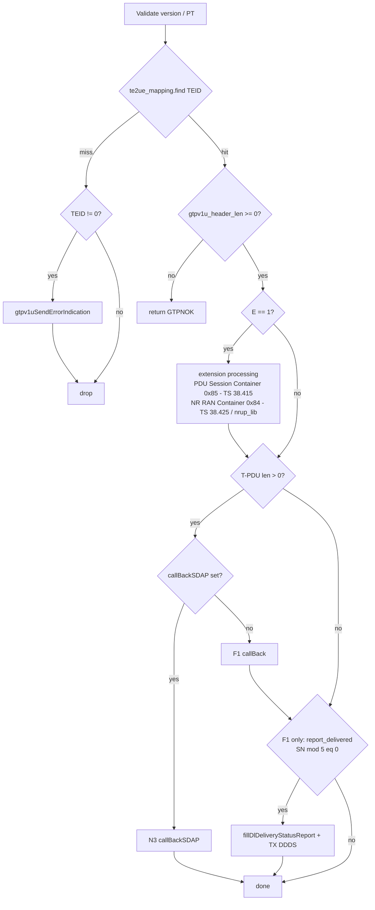
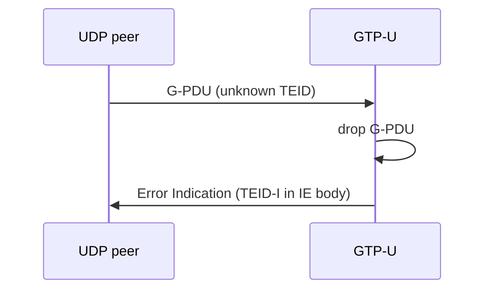
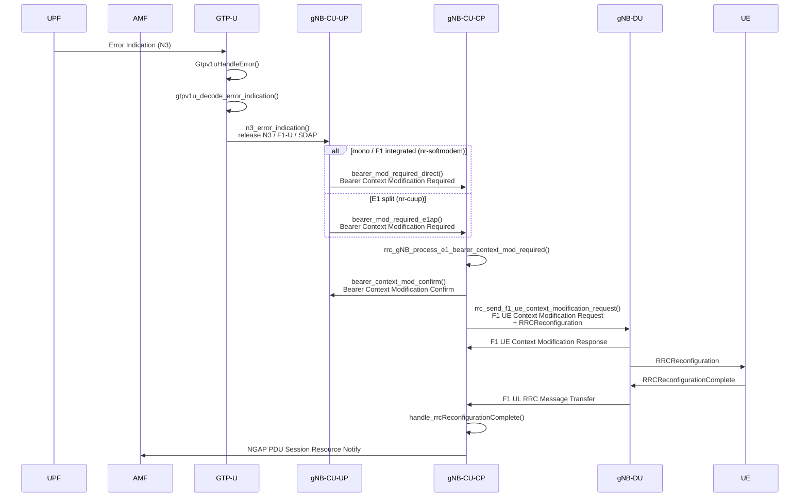

<!-- SPDX-License-Identifier: CC-BY-4.0 -->

# GTP-U design

[[_TOC_]]

## Introduction

OAI's GTP-U implementation lives in `openair3/ocp-gtpu/`. It provides the UDP/GTP-U
user-plane (UP) tunnels used for S1-U (eNB-S-GW), N3 (gNB-UPF), F1-U (CU-DU), and related paths.
This document covers module layout, GTP-U extension headers, G-PDU RX, and Error
Indication. A shorter overview of the GTP thread and tunnel API remains
in [SW_archi.md](../SW_archi.md) (section "GTP" / "New GTP").

### Relevant Specs

* 3GPP TS 29.281: GTP-U
* 3GPP TS 38.415: PDU Session User Plane Protocol
* 3GPP TS 38.425: NR User Plane Protocol
* 3GPP TS 23.527: 5G System Restoration procedures
* 3GPP TS 38.413: NGAP (PDU Session Resource Notify)
* 3GPP TS 38.463: E1AP (Bearer Context Modification Required / Confirm)

### Source layout

| Path | Role |
|------|------|
| `gtp_itf.h/.cpp` | Endpoints, tunnels, TX/RX, Error Indication, G-PDU RX extension walk |
| `gtpu_extensions.{h,c}` | GTP-U extension headers: TX serialize |
| `tests/test_gtp.cpp` | Unit tests |

## G-PDU

Per TS 29.281 definitions: a **T-PDU** (Transport PDU) is the original user data
packet being tunnelled, typically an IP datagram (also Ethernet frame or
unstructured PDU Data). A **G-PDU** is that T-PDU plus the GTP-U header:

```text
G-PDU (message type 255):
  octets 1-8      mandatory GTP-U header
  octets 9-12     optional header (if E=1 or S=1 or PN=1)
  (variable)      extension header chain (if E=1; clause 5.2)
  (remainder)     T-PDU: original user packet (e.g. IP datagram)

Signalling GTP-PDU (e.g. Error Indication):
  octets 1-8      mandatory GTP-U header
  octets 9-12     optional header (if E/S/PN set)
  (remainder)     IE list
```

Error Indication and other GTP-U signalling messages are GTP-PDUs that are not
G-PDUs: their body is an IE list, not a T-PDU.

## GTP-U header layout

TS 29.281 clause 5.1 (Figure 5.1-1). Every GTP-U message starts with a fixed
mandatory part (`Gtpv1uMsgHeaderT`, 8 octets), then an optional 4-octet block when
any of E, S, or PN is set in octet 1:

```text
Mandatory (8 octets):
  octet 1     PN | S | E | spare | PT | version
  octet 2     message type
  octets 3-4  message length
  octets 5-8  TEID

Optional (4 octets, present if E=1 or S=1 or PN=1):
  octets 9-10 sequence number
  octet 11    N-PDU number
  octet 12    next extension header type
```

What follows depends on message type and flags:

* G-PDU with `E=1`: extension header chain (clause 5.2), then T-PDU
* G-PDU with `E=0`: T-PDU starts immediately after the header
* Error Indication: IE list after the header (see Error Indication)

`gtpv1u_header_len()` in `gtp_itf.cpp` returns the byte offset where the body
(extensions, T-PDU, or IEs) begins. G-PDU RX and Error Indication decode call it
before parsing what comes next.

## Extension headers

TX uses `gtpu_extension_header_t` and `serialize_extension()` in
`gtpu_extensions.{h,c}` (`gtpv1uCreateAndSendMsg()` chains extensions for G-PDU TX).

G-PDU RX still walks the 29.281 chain inline inside `Gtpv1uHandleGpdu()`
(`gtp_itf.cpp`): packed TS 38.415 PDU Session Information (QFI / RQI) for Next
Extension Header Type `0x85` (PDU Session Container), and `nrup_lib` decode for
type `0x84` (38.425 DL USER DATA / DDDS).

Per TS 29.281 clause 5.1: when `E=1`, the optional 4 octets are present and
octet 12 holds the first Next Extension Header Type. Per clause 5.2.1, each
extension header length is a positive multiple of 4 octets (`m+1 = n*4`): the
Extension Header Length field is in units of 4 octets and must be non-zero.

```text
Per extension header (Length field x 4 octets):
  octet 1       Extension Header Length (unit = 4 octets, must be != 0)
  octets 2..N-1 Extension Header Content
  octet N       Next Extension Header Type (0 = end of chain)
```

GTP Next Extension Header Type (TS 29.281 Fig. 5.2.1-3) handled in OAI today:

| Type | GTP name (29.281) | Content | TX `gtpu_extension_header_t` |
|------|-------------------|---------|------------------------------|
| `0x84` | NR RAN Container | TS 38.425 NR-U: DL USER DATA, DL DATA DELIVERY STATUS | `GTPU_EXT_DL_USER_DATA`, `GTPU_EXT_DL_DATA_DELIVERY_STATUS` |
| `0x85` | PDU Session Container | TS 38.415: UL PDU Session Information (QFI) | `GTPU_EXT_UL_PDU_SESSION_INFORMATION` |

## G-PDU RX

`Gtpv1uHandleGpdu()`:



## Error Indication

Message type 26 (TS 29.281). Body is an IE list after the GTP-U header
(Table 7.3.1-1: TEID Data I, Peer Address, optional Recovery Time Stamp / Private
Extension).

Typical layout (TS 29.281 clause 7.3.1, header description in
[GTP-U header layout](#gtp-u-header-layout)):

* `S=1`, `E=0`, `PN=0`, header TEID = `0` (clause 5.1, not tunnel-scoped).
* Failed TEID is only in **TEID Data I** (TV, clause 8.3).
* **Peer Address** (TLV, clause 8.4): GTP-U IP of the node that detected the
  error.
* Optional Recovery Time Stamp / Private Extension (not implemented in OAI).
* RX compatibility (`gtpv1u_decode_error_indication()` only): if `S=0` or header
  TEID is non-zero, log a warning and continue.

```text
Header: type=26, TEID=0, S=1 -> IEs from octet 13
  TEID Data I (TV, 8.3)      - TEID in error
  Peer Address (TLV, 8.4)    - IPv4 or IPv6
  Recovery / Private Ext.    - optional; OAI TX omits
```

Trigger: with unknown TEID in `te2ue_mapping` always drop the inbound G-PDU,
if TEID is not 0 also TX Error Indication to the UDP originator, if TEID = 0
drop only with no Error Indication (TS 29.281 §7.3.1 / TS 23.527 §5.2.1).

### APIs (`gtp_itf.h`)

* `gtpv1u_encode_error_indication()` / `gtpv1u_decode_error_indication()`
* Per-tunnel `errorIndicationCallBack` on tunnel create (`newGtpuCreateTunnel` /
  `gtpv1u_create_ngu_tunnel`)

### Implementation

**Spec (TS 23.527 §5.3.3.1):** on N3 Error Indication from the UPF, the 5G-AN
shall release PDU session resources immediately and shall send NGAP PDU Session
Resource Notify (38.413 §8.2.4).
N3 GTP-U (29.281) belongs to CUUP so has no NGAP binding, therefore in OAI
the indication is forwarded to CU-CP **Bearer Context Modification Required**
(§8.3.3) which is used by CU-UP to inform CU-CP about issues in the UP.

TX: unknown inbound G-PDU TEID (TS 29.281 clause 7.3.1 / TS 23.527 clause 5.2.1):
`Gtpv1uHandleGpdu()` always drops the G-PDU and if header TEID is not all zeros
it also calls `gtpv1uSendErrorIndication()`.

**Not implemented:** F1-U Error Indication transmission and handling



RX (N3 Error Indication from UPF). CU-UP to CU-CP direct/e1ap deployment
(`cuup_cucp_direct` vs `cuup_cucp_e1ap`):



## Tests

`openair3/ocp-gtpu/tests/test_gtp.cpp` (`test_gtp`):

* `basic_conn`: tunnel setup, F1 G-PDU (`callBack`)
* `basic_conn_qfi`: N3 G-PDU with QFI (`callBackSDAP`)
* `multi_qos_flows`: multiple QFIs, one PDU session
* `nrup_ddds`: DL USER DATA RX (Report Delivered), DDDS TX
* `error_indication_decode` / `encode`: Error Indication IE codec + negative cases

