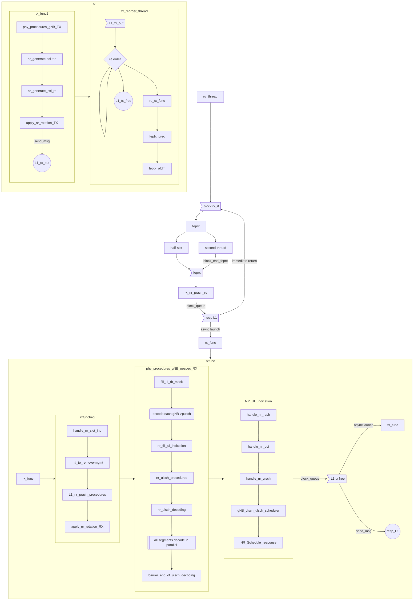
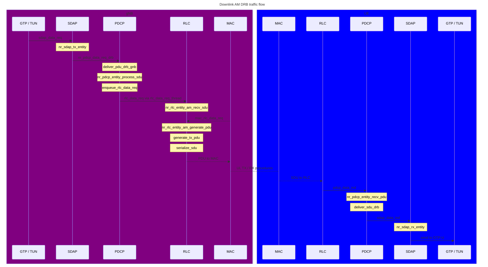
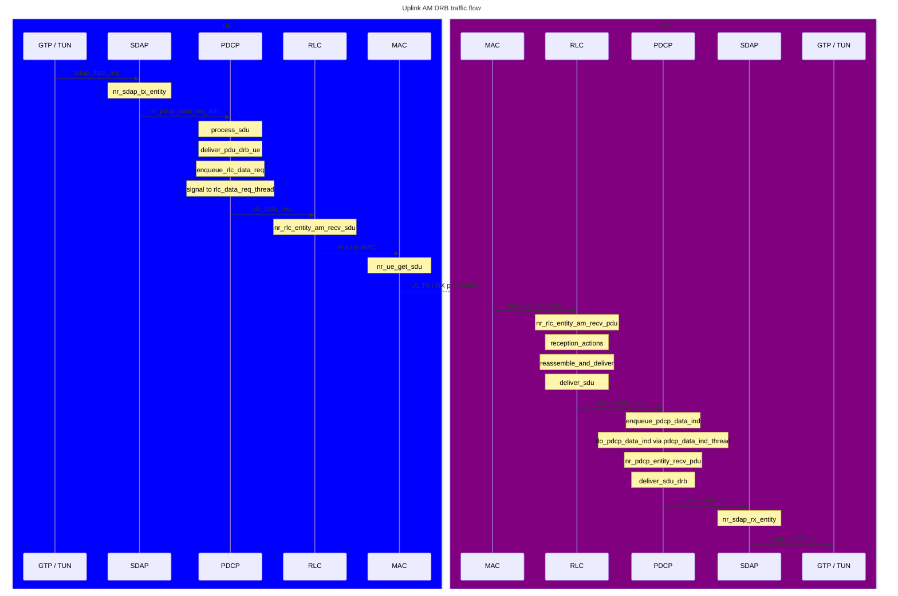

This tuto for 5G gNB design, with Open Cells main
{: .text-center}

# The main thread is in ru_thread()
The infinite loop:
## rx_rf()
  Collect radio signal samples from RF board  
    all SDR processing is triggered by I/Q sample reception and it's date (timestamp)  
    TX I/Q samples will have a date in the future, compared to RX timestamp  
    called for each 5G NR slot  
    it blocks until data is available  
    the internal time comes from the RF board sampling numbers  
    (each sample has a incremental number representing a very accurate timing)  
raw incoming data is in buffer called "rxdata"  
    We derivate frame number, slot number, ... from the RX timestamp
{: .func2}
## nr_fep_full()
"front end processing" of uplink signal  
performs DFT on the signal  
it computes the buffer rxdataF (for frequency) from rxdata (samples over time)  
rxdataF is the rxdata in frequency domain, phase aligned
{: .func3}
## gNB_top()
only compute frame numbre, slot number, ...
{: .func3}
## ocp_rxtx()
main processing for both UL and DL  
start by calling oai_subframe_ind() that trigger processing in pnf_p7_subframe_ind() purpose ???  
all the context is in the passed structure UL_INFO  
the context is not very clear: there is a mutex on it,  
but not actual coherency (see below handle_nr_rach() assumes data is up-to-date)  
The first part (in NR_UL_indication, uses the data computed by the lower part (phy_procedures_gNB_uespec_RX), but for the **previous** slot  
Then, phy_procedures_gNB_uespec_RX will hereafter replace the data for the next run  
This is very tricky and not thread safe at all.
{: .func3}

### NR_UL_indication()  
This block processes data already decoded and stored in structures behind UL_INFO
{: .func4}

* handle_nr_rach()  
process data from RACH primary detection  
if the input is a UE RACH detection
{: .func4}
    * nr_schedule_msg2()
{: .func4}
* handle_nr_uci()  
handles uplink control information, i.e., for the moment HARQ feedback.
{: .func4}
* handle_nr_ulsch()  
handles ulsch data prepared by nr_fill_indication()
{: .func4}
* gNB_dlsch_ulsch_scheduler ()  
the **scheduler** is called here, see dedicated chapter
{: .func4}
* NR_Schedule_response()  
process as per the scheduler decided
{: .func4}

### L1_nr_prach_procedures()  
????
{: .func4}
### phy_procedures_gNB_uespec_RX()
* nr_decode_pucch0()  
actual CCH channel decoding form rxdataF (rx data in frequency domain)  
populates UL_INFO.uci_ind, actual uci data is in gNB->pucch  
{: .func4}
* nr_rx_pusch()  
{: .func4}
    * extracts data from rxdataF (frequency transformed received data)
{: .func4}
    * nr_pusch_channel_estimation()
{: .func4}
    * nr_ulsch_extract_rbs_single()
{: .func4}
    * nr_ulsch_scale_channel()
{: .func4}
    * nr_ulsch_channel_level()
{: .func4}
    * nr_ulsch_channel_compensation()
{: .func4}
    * nr_ulsch_compute_llr()  
this function creates the "likelyhood ratios"  
{: .func4}
* nr_ulsch_procedures()
{: .func4}
    * actual ULsch decoding
{: .func4}
    * nr_ulsch_unscrambling()
 {: .func4}
   * nr_ulsch_decoding()
 {: .func4}
   * nr_fill_indication()   
populate the data for the next call to "NR_UL_indication()"  
it would be better to call **NR_UL_indication()** now instead of before (on previous slot)
{: .func4}

### phy_procedures_gNB_TX()
* nr_common_signal_procedures()  
generate common signals
{: .func4}
* nr_generate_dci_top()
generate DCI: the scheduling informtion for each UE in both DL and UL
{: .func4}
* nr_generate_pdsch()  
generate DL shared channel (user data)
{: .func4}

### nr_feptx_prec()
tx precoding
{: .func3}
### nr_feptx0
do the inverse DFT
{: .func3}
### tx_rf()
send radio signal samples to the RF board  
the samples numbers are the future time for these samples emission on-air
{: .func3}

# Scheduler

The main scheduler function  is called by the chain: nr_ul_indication()=>gNB_dlsch_ulsch_scheduler()
It calls sub functions to process each physical channel (rach, ...)  
The scheduler uses and internal map of used RB: vrb_map and vrb_map_UL, so each specific channel scheduler can see the already filled RB in each subframe (the function gNB_dlsch_ulsch_scheduler() clears these two arrays when it starts)   

The scheduler also calls "run_pdcp()", as this is not a autonomous thread, it needs to be called here to update traffic requests (DL) and to propagate waiting UL to upper layers  
After calling run_pdcp, it updates "rlc" time data but it doesn't actually process rlc 
it sends a iiti message to activate the thread for RRC, the answer will be asynchronous in ????  

Calls schedule_nr_mib() that fills MIB,

Calls schedule_nr_prach() which schedules the (fixed) PRACH region one frame in
advance.

Calls nr_csi_meas_reporting() to check when to schedule CSI in PUCCH.

Calls nr_schedule_RA(): checks RA process 0's state. Schedules Msg.2 via
nr_generate_Msg2() if an RA process is ongoing, and pre-allocates the Msg. 3
for PUSCH as well.

Calls nr_schedule_ulsch(): It is divided into the "preprocessor" and the
"postprocessor": the first makes the scheduling decisions, the second fills
nFAPI structures to indicate to the PHY what it is supposed to do. To signal
which users have how many resources, the preprocessor populates the
NR_sched_pusch_t (for values changing every TTI, e.g., frequency domain
allocation) and NR_sched_pusch_save_t (for values changing less frequently, at
least in FR1 [to my understanding], e.g., DMRS fields when the time domain
allocation stays between TTIs) structures. Furthermore, the preprocessor is an
exchangeable module that schedules differently based on a particular
use-case/deployment type, e.g., one user for phytest [in
nr_ul_preprocessor_phytest()], multiple users in FR1
[nr_fr1_ulsch_preprocessor()], or maybe FR2 [does not exist yet]:
* calls preprocessor via pre_processor_ul(): the preprocessor is responsible
  for allocating CCEs (using allocate_nr_CCEs()) and deciding on resource
  allocation for the UEs including TB size. Note that we do not yet have
  scheduling requests. What it typically does:
  1)  check whether the current frame/slot plus K2 is an UL slot, and return if
      not.
  2)  Find first free start RB in vrb_map_UL, and as many free consecutive RBs
      as possible.
  3)  Either set up resource allocation directly (e.g., for a single UE,
      phytest), or call into a function to perform actual resource allocation.
      Currently, this is done using pf_ul() which implements a basic
      proportional fair scheduler:
      * for every UE, check for retransmission and allocate as necessary
      * Calculate DMRS stuff (nr_set_pusch_semi_static())
      * Calculate the PF coefficient and put eligible UEs into a list
      * Allocate resources to the UE(s) with the highest coefficient
  4)  Mark used resources in vrb_map_UL.
* loop through all users: get a HARQ process as indicated through the
  preprocessor, update statistics, fill nFAPI structures directly for PUSCH,
  and call config_uldci() and fill_dci_pdu_rel15() for DCI filling and PDCCH
  messages.

Calls nr_schedule_ue_spec(). It is divided into the "preprocessor" and the
"postprocessor": the first makes the scheduling decisions, the second fills
nFAPI structures to indicate to the PHY what it is supposed to do. To signal
which users have how many resources, the preprocessor populates the
NR_UE_sched_ctrl_t structure of affected users. In particular, the field rbSize
decides whether a user is to be allocated. Furthermore, the preprocessor is an
exchangeable module that schedules differently based on a particular
use-case/deployment type, e.g., one user for phytest [in
nr_preprocessor_phytest()], multiple users in FR1
[nr_fr1_dlsch_preprocessor()], or maybe FR2 [does not exist yet].
* calls preprocessor via pre_processor_dl(): the preprocessor is responsible
  for allocating CCEs and PUCCH (using allocate_nr_CCEs() and
  nr_acknack_scheduling()) and deciding on the frequency/time domain
  allocation including the TB size. What it typically does:
  1)  Check available resources in the vrb_map
  2)  Checks the quantity of waiting data in RLC
  3)  Either set up resource allocation directly (e.g., for a single UE,
      phytest), or call into a function to perform actual resource allocation.
      Currently, this is done using pf_dl() which implements a basic
      proportional fair scheduler:
      * for every UE, check for retransmission and allocate as necessary
      * Calculate the PF coefficient and put eligible UEs into a list
      * Allocate resources to the UE(s) with the highest coefficient
  4)  Mark taken resources in the vrb_map
* loop through all users: check if a new TA is necessary. Then, if a user has
  allocated resources, update statistics (round, sent bytes), update HARQ
  process information, and fill nFAPI structures (allocate a DCI and PDCCH
  messages, TX_req, ...)

# RRC
RRC is a regular thread with itti loop on queue: TASK_RRC_GNB
it receives it's configuration in message NRRRC_CONFIGURATION_REQ, then real time mesages for all events: S1/NGAP events, X2AP messages and RRC_SUBFRAME_PROCESS  
  
RRC_SUBFRAME_PROCESS message is send each subframe  
  
how does it communicate to  scheduler ?  

# RLC
RLC code is new implementation, not using OAI mechanisms: it is implemented directly on pthreads, ignoring OAI common functions.  
It is a library, running in thread RRC but also in PHY layer threads and some bits in pdcp running thread or F1 interface threads.

RLC data is isolated and encapsulated.
It is stored under a global var: nr_rlc_ue_manager
The init function rlc_module_init() populates this global variable.
A small effort could lead us to return the pointer to the caller of rlc_module_init() (internal type: nr_rlc_ue_manager_internal_t)  
but it returns void.  
It could return the initialized pointer (as FILE* fopen() for example), then the RLC layer could have multiple instances in one process.
Even, a future evolution could remove this global rlc layer: rlc can be only a library that we create a instance for each UE because it doesn't shareany data between UEs.

When adding a UE, external code have to call `add_rlc_srb()` and/or `add_rlc_drb()`, to remove it: `rrc_rlc_remove_ue()`
Inside UE, channels called drd or srb can be created: ??? and deleted: rrc_rlc_config_req()

nr_rlc_tick() must be called periodically to manage the internal timers 

successful_delivery() and max_retx_reached(): in ??? trigger, the RLC sends a itti message to RRC: RLC_SDU_INDICATION (neutralized by #if 0 right now)

## RLC data flow

### TX Flow

Incoming data to be transmitted is forwarded to RLC by PDCP via `rlc_data_req()`.

At the transport layer, in downlink (DL) at the gNB and uplink (UL) at UE, the scheduler relies on knowing the quantity of data awaiting transmissionis, therefore is using the following MAC/RLC interface functions:

* `mac_rlc_data_req()` to retrieve data bytes to be transmitted by RLC and to fill the MAC SDU
* `mac_rlc_status_ind()` to request and set the number of bytes scheduled for transmission by the RLC

Subsequently, the scheduler issues commands to lower layers.

### RX Flow

In the RX chain, in downlink (DL) at the UE and uplink (UL) at gNB, the transport layer pushes data into RLC through `mac_rlc_data_ind()`. Following this, RLC forwards the data to PDCP by invoking `pdcp_data_ind()` via a complex internal callback mechanism (`deliver_sdu()`).

# PDCP

The PDCP implementation is secured by a general mutex, akin to the design of the RLC layer. This setup ensures that PDCP data remains isolated and encapsulated.

Initialization of the PDCP layer follows a structure similar to that of the RLC layer. The function `nr_pdcp_layer_init()` initializes PDCP, while a second initialization function, `pdcp_module_init()`, must also be invoked.

To manage UE connections, `nr_pdcp_add_srbs()` is employed for adding UE SRBs in PDCP, while `nr_pdcp_remove_UE()` is used for their removal. Similarly, `nr_pdcp_add_drbs()` adds UE DRBs in PDCP, with `nr_pdcp_remove_UE()` handling their removal.

## PDCP Tx flow

On the Tx side (downlink in gNB), the entry functions `nr_pdcp_data_req_drb()` and `nr_pdcp_data_req_srb()` are called by the upper layer. The upper layer could be GTP or a PDCP internal thread like `enb_tun_read_thread()`, which reads directly from the Linux socket if the 3GPP core implementation is skipped. The PDCP internals for `nr_pdcp_data_req_srb()` and `nr_pdcp_data_req_drb()` are thread-safe. Within these functions, the PDCP manager protects access to the SDU receiving function of PDCP (`recv_sdu()` callback, corresponding to `nr_pdcp_entity_recv_pdu()` for DRBs) using mutex. When necessary, the PDCP layer pushes this data to RLC by calling `rlc_data_req()`.

## PDCP Rx flow

At the Rx side, `pdcp_data_ind()` serves as the entry point for receiving data from RLC. Within `pdcp_data_ind()`, the PDCP manager mutex protects access to the PDU receiving function of PDCP (`recv_pdu()` callback corresponding to `nr_pdcp_entity_recv_pdu()` for DRBs). Following this, the `deliver_sdu_drb()` function dispatches the received data to the GTP thread via an ITTI message (`GTPV1U_TUNNEL_DATA_REQ`).

## PDCP security

nr_pdcp_config_set_security(): sets the keys for AS security of a UE

# AM DRB traffic flow in OAI

A sequence diagram of the traffic flow across PDCP and RLC layers. By default, data traffic is directed towards AM DRBs.

This is the flow for downlink, involving MAC and upper layers:

and for uplink:

# GTP
Gtp + UDP are two twin threads performing the data plane interface to the core network
The design is hybrid: thread and inside other threads calls. It should at least be protected by a mutex.
## GTP thread
Gtp thread has a itti interface: queue TASK_GTPV1_U  
The interface is about full definition: control messages (create/delet GTP tunnels) and data messages (user plane UL and DL).  
PDCP layer push to the GTP queue (outside UDP thread that do almost nothing and work only with GTP thread) is to push a UL packet.

## GTP thread running code from other layers
gtp thread calls directly nr_pdcp_data_req_drb(), so it runs inside it's context internal pdcp structures updates

## inside other threads
gtpv1u_create_s1u_tunnel(), delete tunnel, ... functions are called inside the other threads, without mutex.

# New GTP
## initialization

gtpv1uTask(): this creates only the thread, doesn't configure anything
gtpv1Init(): creates a listening socket to Linux for a given reception and select a local IP address

## newGtpuCreateTunnel()   
this function will replace the xxx_create_tunnel_xxx() for various cases  
The parameters are: 
1. outgoing TEid, associated with outpoing pair(rnti, id)
2. incoming packets callback, incoming pair(rnti,id) and a callback function for incoming data 

## outgoing packets 

Each call to newGtpuCreateTunnel() creates a outgoing context for a teid (given as function input), a pair(rnti,outgoing id).  
 Each outgoing packet received on GTP-U ITTI queue must match one pair(rnti,id), so the gtp-u thread can lookup the related TEid and use it to encode the outpoing GTP-U tunneled packet.  

## incoming packets   

newGtpuCreateTunnel() computes and return the incoming teid that will be used for incoming packets.
When a incoming packet arrives on this incoming teid, the GTP-U thread calls the defined callback, with the associated pair(rnti, incoming id).  

stuff like enb_flag, mui and more important data are not given explicitly by any legacy function (gtpv1u_create_s1u_tunnel), but the legacy and the new interface to lower layer (like pdcp) require this data. We hardcode it in first version.

## remaining work 
These teids and "instance", so in a Linux socket: same teid can co-exist for different sockets
 Remain here a lack to fill: the information given in the legacy funtions is not enough to fullfil the data needed by the callback  

Coexistance until full merge with legacy GTP
cmake new option: NEW_GTPU to use the new implementation (it changes for the entire executable)
It is possible to use both old and new GTP in same executable because the itti task and all functions names are different 
Current status of new implementation: not tested, X2 not developped, 5G new GTP option not developped, remain issues on data coming from void: muid, enb_flag, ...

# NGAP
NGAP would be a itti thread as is S1AP (+twin thread SCTP that is almost void processing)?  
About all messages are exchanged with RRC thread  

**Note**
{: .panel-heading}

