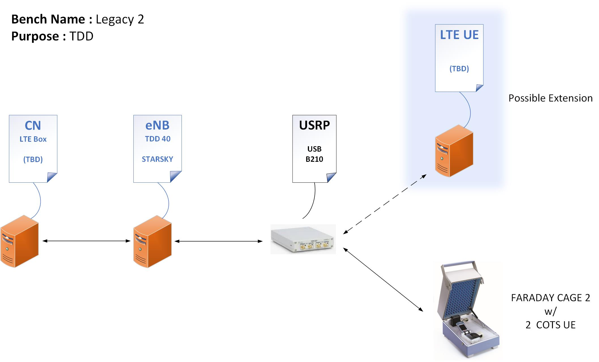
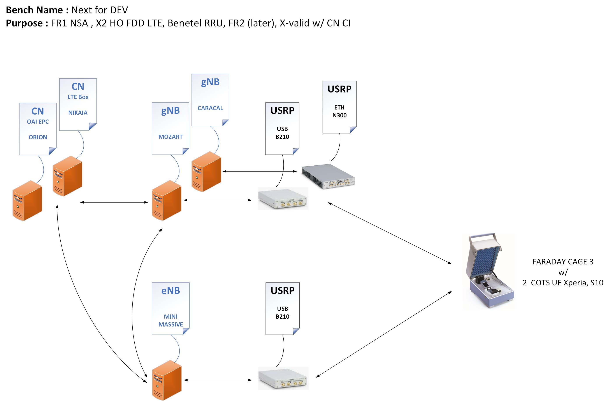
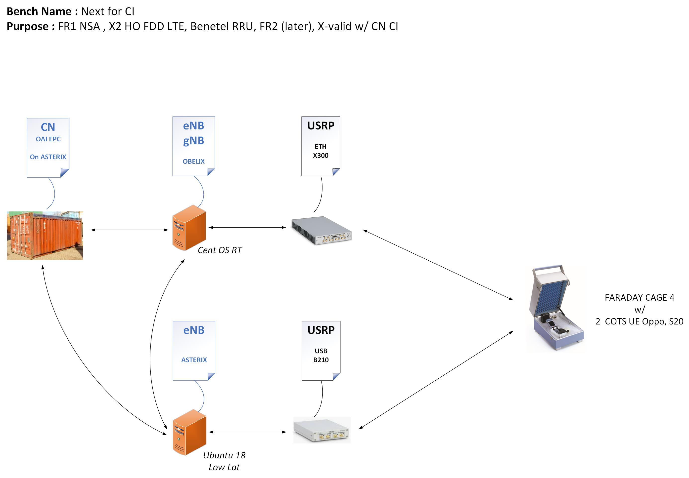
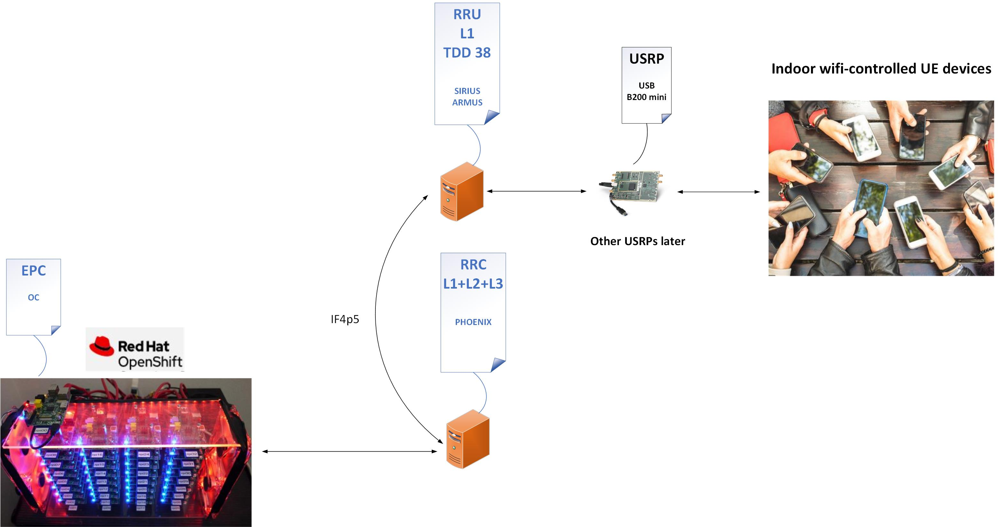
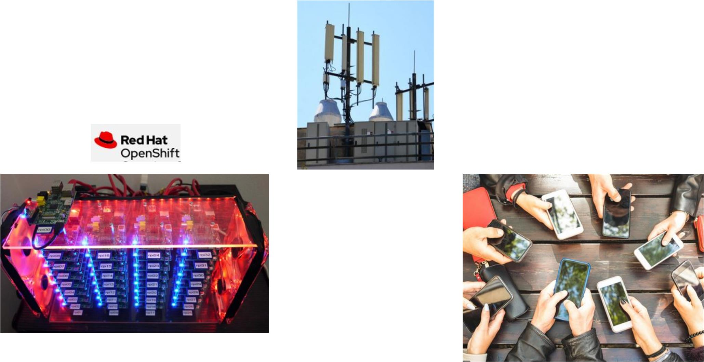

## Table of Contents ##

1.   [Legacy 1 Bench](#legacy-1-bench)
2.   [Legacy 2 Bench](#legacy-2-bench)
3.   [Next Bench for DEV](#next-bench-for-dev)
4.   [Next Bench for CI](#next-bench-for-ci)
5.   [Indoor Live Network Bench](#indoor-live-network-bench)
6.   [Outdoor Live Network Bench](#outdoor-live-network-bench)

## Legacy 1 Bench

**Purpose** : FDD Band 7 and Band 13, LTE-M  
**Note** : Legacy1 and Legacy2 are duplicated so that they can run in parallel, thus avoiding a CI bottleneck  
**Note** : Faraday Cages 1 and 2 are physically the same cage  

## Legacy 2 Bench

**Purpose** : TDD Band 40, TM2 2xTX 2xRX  
**Note** : CN can run in a container, could also run on Massive 

## Next Bench for DEV

**Note** : Benetel CI can also run on this bench at night 

## Next Bench for CI

**Note** : The current test running on Caracal could run on this bench with a N300/N300 setup  

## Indoor Live Network Bench

## Outdoor Live Network Bench

