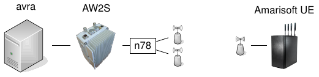

**Table of Contents**

[[_TOC_]]

## Machines

| Machine       | IP address      | Lockable Resource     | Function           | Connected devices                                     |
| ------------- | --------------- | --------------------- | ------------------ | ----------------------------------------------------- |
| asterix       | 172.21.16.127   | CI-Asterix-Usage      | *unused*           | 172.21.19.14                                          |
| obelix        | 172.21.16.128   | CI-Obelix-Usage       | eNB (n40, n78), nrUE | 172.21.19.13, X300 (192.168.60.2)                   |
| porcepix      | 172.21.16.136   | CI-Porcepix           | Executor, EPC, 5GC | --                                                    |
| nrmodule2     | 172.21.16.139   | CI-NrModule2          | Quectel            | Quectel module                                        |
| nepes         | 172.21.16.137   | CI-Nepes              | gNB (n78), EPC/5GC | B200mini (30C51EB)                                    |
| ofqot         | 172.21.16.109   | CI-Ofqot              | gNB (n78)          | B200mini (30C51D4)                                    |
| idefix        | 172.21.16.135   | CI-Idefix             | Quectel            | Quectel module                                        |
| caracal       | 172.21.16.132   | CI-Caracal            | gNB/phytest        | N300 (192.168.10.2)                                   |
| amariue       | 172.21.16.144   | CI-Amarisoft-UE-Usage | nrUE               | Amarisoft UE simulator                                |
| nano          | 172.21.18.48    | CI-Nano-Legacy-EPC    | Executor, EPC, adb | 2x COTS (adb)                                         |
| hutch         | 172.21.18.46    | CI-Hutch-Legacy-FDD-eNB | eNB (B7)           | B200mini (30C5239)                                  |
| starsky       | 172.21.18.45    | CI-Starsky-Legacy-TDD-eNB       | eNB (B40)  | b200mini (30A3E3C)                                  |
| carabe        | 172.21.18.47    | CI-Carabe-Legacy-FDD-OAI-LTE-UE | UE (B7UE)  | B200mini (30AE8C9)                                  |
| nokiabox      | 172.21.19.39    | _None_                | gNB (Nokia), 5GC   | _Nokia RF integrated_                                 |
| avra          | 172.21.16.124   | CI-Avra-Usage         | gNB (n78)          | AW2S Jaguar (192.168.80.239)                          |
| orion         | 172.21.16.134   | CI-Orion-Build-Sanity-Check-Deploy-Test, CI-Orion-DsTester-Deploy-Test | Build | |
| bellatrix     | 172.21.16.104   | CI-Bellatrix-RAN-Docker | Static Code Analysis | --                                                    |

Note: The available resources, and their current usage, is indicated here:
- [Lockable resources of jenkins-oai](https://jenkins-oai.eurecom.fr/lockable-resources/):
  "New" Jenkins, i.e., with RAN-Container-Parent

## Testbenches

### 5G OTA Testbench

**Purpose**: Over-the-air 4G/5G (NSA/SA) tests, performance tests


[PDF version](testbenches_doc_resources/5g-ota-bench.pdf) | [LaTeX/TikZ version](testbenches_doc_resources/5g-ota-bench.tex) if you want to modify to reflect your setup


### 5G NSA/Faraday Cage Testbench

**Purpose**: Faraday cage 5G tests, functional tests


[PDF version](testbenches_doc_resources/5g-nsa-faraday-bench.pdf) | [LaTeX/TikZ version](testbenches_doc_resources/5g-nsa-faraday-bench.tex) if you want to modify to reflect your setup

### 5G AW2S Testbench

**Purpose**: AW2S tests with Amarisoft UE simulator



[PDF version](testbenches_doc_resources/5g-aw2s-bench.pdf) | [LaTeX/TikZ version](testbenches_doc_resources/5g-aw2s-bench.tex) if you want to modify to reflect your setup

### 5G UE OTA Testbench

**Purpose**: Over-the-air 5G tests with OAI UE


[PDF version](testbenches_doc_resources/5g-nrue-bench.pdf) | [LaTeX/TikZ version](testbenches_doc_resources/5g-nrue-bench.tex) if you want to modify to reflect your setup

### 4G Testbench(es)

**Purpose**: 4G/LTE testbenches


[PDF version](testbenches_doc_resources/4g-faraday-bench.pdf) | [LaTeX/TikZ version](testbenches_doc_resources/4g-faraday-bench.tex) if you want to modify to reflect your setup

## Pipelines

### [RAN-Container-Parent](https://jenkins-oai.eurecom.fr/job/RAN-Container-Parent/)

**Purpose**: automatically triggered tests on MR creation or push, from Gitlab
Webhook ~documentation ~BUILD-ONLY ~4G-LTE ~5G-NR

This pipeline has basically two main stages, as follows. For the image build,
please also refer to the [dedicated documentation](../docker/README.md) for
information on how the images are built.

#### Image Build pipelines

- [RAN-ARM-Cross-Compile-Builder](https://jenkins-oai.eurecom.fr/job/RAN-ARM-Cross-Compile-Builder/)
  ~BUILD-ONLY ~4G-LTE ~5G-NR
  - orion: Cross-compilation from Intel to ARM
  - base image from `Dockerfile.base.ubuntu20.cross-arm64`
  - build image from `Dockerfile.build.ubuntu20.cross-arm64` (no target images)
- [RAN-cppcheck](https://jenkins-oai.eurecom.fr/job/RAN-cppcheck/)
  ~BUILD-ONLY ~4G-LTE ~5G-NR
  - bellatrix
  - performs static code analysis, currently not actively enforced
- [RAN-RHEL8-Cluster-Image-Builder](https://jenkins-oai.eurecom.fr/job/RAN-RHEL8-Cluster-Image-Builder/)
  ~BUILD-ONLY ~4G-LTE ~5G-NR
  - cluster (`Asterix-OC-oaicicd-session` resource): RHEL image build using the OpenShift Cluster (using gcc/clang)
  - base image from `Dockerfile.build.rhel9`
  - build image from `Dockerfile.build.rhel9`, followed by
    - target image from `Dockerfile.eNB.rhel9`
    - target image from `Dockerfile.gNB.rhel9`,
    - target image from `Dockerfile.gNB.aw2s.rhel9`
    - target image from `Dockerfile.nr-cuup.rhel9`
    - target image from `Dockerfile.lteUE.rhel9`
    - target image from `Dockerfile.nrUE.rhel9`
  - build image from `Dockerfile.phySim.rhel9` (creates as direct target physical simulator
    image)
  - build image from `Dockerfile.clang.rhel9` (compilation only, artifacts not used currently)
- [RAN-Ubuntu18-Image-Builder](https://jenkins-oai.eurecom.fr/job/RAN-Ubuntu18-Image-Builder/)
  ~BUILD-ONLY ~4G-LTE ~5G-NR
  - run formatting check from `ci-scripts/docker/Dockerfile.formatting.bionic`
  - obelix: Ubuntu 20 image build using docker (Note: builds U20 images while pipeline is named U18!)
  - base image from `Dockerfile.base.ubuntu20`
  - build image from `Dockerfile.build.ubuntu20`, followed by
    - target image from `Dockerfile.eNB.ubuntu20`
    - target image from `Dockerfile.gNB.ubuntu20`
    - target image from `Dockerfile.nr-cuup.ubuntu20`
    - target image from `Dockerfile.nrUE.ubuntu20`
    - target image from `Dockerfile.lteUE.ubuntu20`
    - target image from `Dockerfile.lteRU.ubuntu20`
  - build unit tests from `ci-scripts/docker/Dockerfile.unittest.ubuntu20`, and run them

#### Image Test pipelines

- [OAI-CN5G-COTS-UE-Test](https://jenkins-oai.eurecom.fr/job/OAI-CN5G-COTS-UE-Test/)
  ~5G-NR
  - using 5GC bench (resources `CI-Cetautomatix-OC-oaicicd-session`, `CI-Dogmatix-CN5G-gNB`): Attach/Detach of UE with multiple PDU sessions
- [RAN-gNB-N300-Timing-Phytest-LDPC](https://jenkins-oai.eurecom.fr/view/RAN/job/RAN-gNB-N300-Timing-Phytest-LDPC/)
  ~5G-NR
  - caracal + N310
  - pure performance test through phy-test scheduler, see command line for more details
- [RAN-Interop-F1](https://jenkins-oai.eurecom.fr/job/RAN-Interop-F1/)
  ~5G-NR
  - ofqot (DU, 1x UE)
  - F1 interoperability: set up connection between Accelleran CU and OAI DU and pass all traffic over F1
  - 3rd-party gNB/CU interoperability: set up connection between Accelleran CU and OAI UE and test connectivity
- [RAN-L2-Sim-Test-4G](https://jenkins-oai.eurecom.fr/job/RAN-L2-Sim-Test-4G/)
  ~4G-LTE
  - obelix (eNB, 1x UE, OAI EPC)
  - L2simulator: skips physical layer and uses proxy between eNB and UE
- [RAN-L2-Sim-Test-5G](https://jenkins-oai.eurecom.fr/job/RAN-L2-Sim-Test-5G/)
  ~5G-NR
  - obelix (gNB, 1x UE, OAI 5GC)
  - L2simulator: skips physical layer and uses proxy between gNB and UE, currently only ping
- [RAN-LTE-FDD-LTEBOX-Container](https://jenkins-oai.eurecom.fr/job/RAN-LTE-FDD-LTEBOX-Container/)
  ~4G-LTE
  - hutch + B210, nano w/ ltebox + 2x UE
  - tests RRC inactivity timers, different bandwidths, IF4p5 fronthaul
- [RAN-LTE-FDD-OAIUE-OAICN4G-Container](https://jenkins-oai.eurecom.fr/job/RAN-LTE-FDD-OAIUE-OAICN4G-Container/)
  ~4G-LTE
  - hutch + B210 (eNB), carabe + B210 (4G UE), nano w/ OAI 4GC
  - tests OAI 4G for 10 MHz/TM1; known to be unstable
- [RAN-LTE-TDD-2x2-Container](https://jenkins-oai.eurecom.fr/view/RAN/job/RAN-LTE-TDD-2x2-Container/)
  ~4G-LTE
  - obelix + N310, porcepix, nrmodule2 + Quectel
  - TM1 and TM2 test, IF4p5 fronthaul
- [RAN-LTE-TDD-LTEBOX-Container](https://jenkins-oai.eurecom.fr/job/RAN-LTE-TDD-LTEBOX-Container/)
  ~4G-LTE
  - starsky + B210, nano w/ ltebox + 2x UE
  - TM1 over bandwidths 5, 10, 20 MHz in Band 40, default scheduler for 20 MHz
- [RAN-NSA-B200-Module-LTEBOX-Container](https://jenkins-oai.eurecom.fr/job/RAN-NSA-B200-Module-LTEBOX-Container/)
  ~4G-LTE ~5G-NR
  - nepes + B200 (eNB), ofqot + B200 (gNB), idefix + Quectel, nepes w/ ltebox
  - basic NSA test
- [RAN-PhySim-Cluster](https://jenkins-oai.eurecom.fr/job/RAN-PhySim-Cluster/)
  ~4G-LTE ~5G-NR
  - cluster (`Asterix-OC-oaicicd-session` resource), tests in OpenShift Cluster
  - unitary simulators (`nr_dlsim`, etc.)
- [RAN-RF-Sim-Test-4G](https://jenkins-oai.eurecom.fr/job/RAN-RF-Sim-Test-4G/)
  ~4G-LTE
  - obelix (eNB, lteUE, OAI EPC)
  - uses RFsimulator, for FDD 5, 10, 20MHz with core, 5MHz noS1
- [RAN-RF-Sim-Test-5G](https://jenkins-oai.eurecom.fr/job/RAN-RF-Sim-Test-5G/)
  ~5G-NR
  - obelix (gNB, nrUE, OAI 5GC)
  - uses RFsimulator, TDD 40MHz, FDD 40MHz, F1 split
- [RAN-SA-AW2S-CN5G](https://jenkins-oai.eurecom.fr/job/RAN-SA-AW2S-CN5G/)
  ~5G-NR
  - 5G-NR SA test setup: avra(RHEL9.1) + AW2S, amariue, OAI CN5G
  - uses OpenShift cluster for CN deployment and container images for gNB deployment
  - multi UE testing using Amarisoft UE simulator
- [RAN-SA-B200-Module-SABOX-Container](https://jenkins-oai.eurecom.fr/job/RAN-SA-B200-Module-SABOX-Container/)
  ~5G-NR
  - ofqot + B200, idefix + Quectel, nepes w/ sabox
  - basic SA test (20 MHz TDD), F1, reestablishment, ...
- [RAN-SA-OAIUE-CN5G](https://jenkins-oai.eurecom.fr/job/RAN-SA-OAIUE-CN5G/)
  ~5G-NR
  - 5G-NR SA test setup: gNB on avra(RHEL9.2) + N310, OAIUE on caracal(RHEL9.1) + N310, OAI CN5G
  - OpenShift cluster for CN deployment and container images for gNB and UE deployment

### RAN-CI-NSA-Trigger

***DEFUNCT***: longer-running over-the-air LTE, NSA, and SA tests. To be integrated into RAN-Container-Parent.

- [RAN-NSA-2x2-Module-OAIEPC](https://jenkins-oai.eurecom.fr/job/RAN-NSA-2x2-Module-OAIEPC/)
  - obelix + N310 (eNB), asterix + N310 (gNB), nrmodule2 + Quectel, porcepix w/ Magma EPC
  - LTE 2x2 and NR 2x2 (non-standalone)
- [RAN-SA-Module-CN5G](https://jenkins-oai.eurecom.fr/view/RAN/job/RAN-SA-Module-CN5G/)
  - asterix + N310 (gNB), nrmodule2 + Quectel, porcepix w/ OAI 5GC
  - NR 2x2 (standalone)

## How to reproduce CI results

The CI builds docker images at the beginning of every test run. To see the
exact command line steps, please refer to the `docker/Dockerfile.build.*`
files. Note that the console log of each pipeline run also lists the used
docker files.

The CI uses these images for *most* of the pipelines. It uses docker-compose to
orchestrate the images. To identify the docker-compose file, follow these
steps:

1. Each CI test run HTML lists the XML file used for a particular test run.
   Open the corresponding XML file under `ci-scripts/xml_files/`.
2. The XML file has a "test case" that refers to deployment of the image; it
   will reference a directory containing a YAML file (the docker-compose file)
   using option `yaml_path`, which will be under `ci-scripts/yaml_files/`. Go
   to this directory and open the docker-compose file.
3. The docker-compose file can be used to run images locally, or you can infer
   the used configuration file and possible additional options that are to be
   passed to the executable to run from source.

For instance, to see how the CI runs the multi-UE 5G RFsim test case, the above
steps look like this:

1. The first tab in the 5G RFsim test mentions
   `xml_files/container_5g_rfsim.xml`, so open
   `ci-scripts/xml_files/container_5g_rfsim.xml`.
2. This XML file has a `DeployGenObject` test case, referencing the directory
   `yaml_files/5g_rfsimulator`. The corresponding docker-compose file path is
   `ci-scripts/yaml_files/5g_rfsimulator/docker-compose.yaml`.
3. To know how to run the gNB, realize that there is a section `oai-gnb`. It
   mounts the configuration
   `ci-scripts/conf_files/gnb.sa.band78.106prb.rfsim.conf` (note that the path
   is relative to the directory in which the docker-compose file is located).
   Further, an environment variable `USE_ADDITIONAL_OPTIONS` is declared,
   referencing the relevant options `--sa -E --rfsim` (you can ignore logging
   options). You would therefore run the gNB from source like this:
   ```
   sudo ./cmake_targets/ran_build/build/nr-softmodem -O ci-scripts/conf_files/gnb.sa.band78.106prb.rfsim.conf --sa -E --rfsim
   ```
   To run this on your local machine, assuming you have a 5GC installed, you
   might need to change IP information in the config to match your core.

If you wish, you can rebuild CI images locally following [these
steps](../docker/README.md) and then use the docker-compose file directly.

Some tests are run from source (e.g.
`ci-scripts/xml_files/gnb_phytest_usrp_run.xml`), which directly give the
options they are run with.
