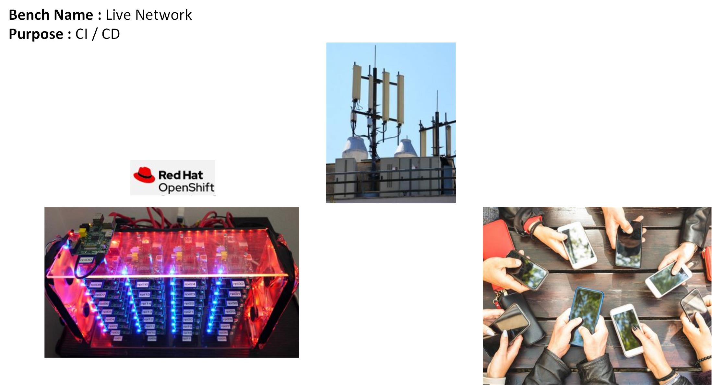
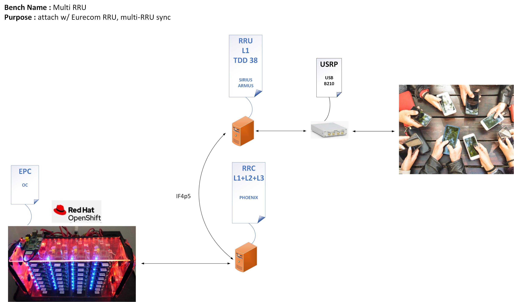

## Table of Contents ##

1.   [Legacy 1 Bench](#legacy-1-bench)
2.   [Legacy 2 Bench](#legacy-2-bench)
3.   [Next Bench for DEV](#next-bench-for-dev)
4.   [Next Bench for CI](#next-bench-for-ci)
5.   [Live Network Bench](#live-network-bench)
6.   [Multi-RRU Bench](#multi-rru-bench)

## Legacy 1 Bench

## Legacy 2 Bench

## Next Bench for DEV

## Next Bench for CI

## Live Network Bench

## Multi-RRU Bench

