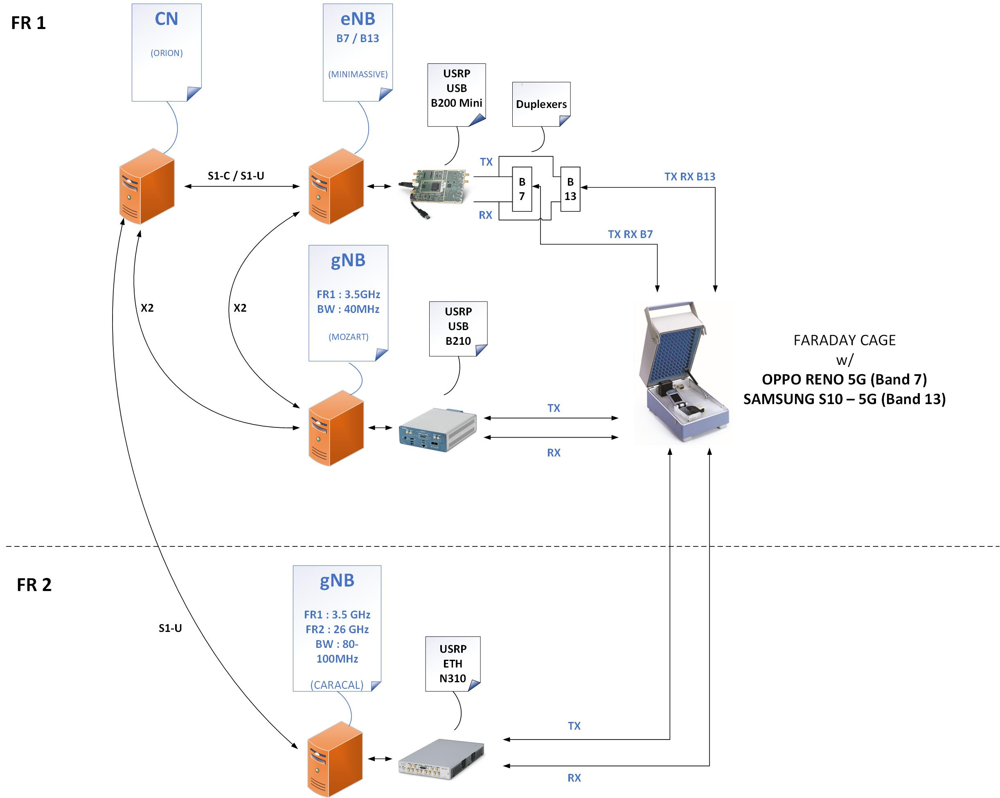

## Configuration Overview:

* Non Standalone (NSA) configuration  : initial Control Plane established between UE and RAN eNB, then User Plane established between UE and gNB, Core network is 4G based supporting rel 15

* Commercial UE: Oppo Reno 5G
* OAI Software Defined gNB and eNB
* eNB RF front end: USRP (ETTUS) B200 Mini or B210
* gNB RF front end: USRP (ETTUS) B200 Mini or B210 (N300 will be needed for MIMO and wider BW's)
* 5G TDD duplexing mode
* 5G FR1 Band n78 (3.5 GHz)
* BW: 40MHz
* Antenna scheme: SISO

## SW Repository / Branch

https://gitlab.eurecom.fr/oai/openairinterface5g/tree/develop

## Architecture Setup

photos and schemes




## Build / Install

General guidelines for building :
See https://gitlab.eurecom.fr/oai/openairinterface5g/blob/develop/doc/BUILD.md#building-ues-enodeb-and-gnodeb-executables

- **EPC**

for reference:
https://github.com/OPENAIRINTERFACE/openair-epc-fed/blob/master-documentation/docs/DEPLOY_HOME.md

```
sudo bash
cd /opt/hss_sim0609
./starthss_real
```

- **eNB**

```
sudo bash
cd /opt/hss_sim0609
./starthss_real
```

- **gNB**

```
sudo bash
cd /opt/hss_sim0609
./starthss_real
```

## Conf Files

where are they
usage

## Run / Test


- **EPC** (on EPC host):

```
sudo bash
cd /opt/hss_sim0609
./starthss_real
```

Open another window and:

```
sudo bash
cd /opt/ltebox/tools
./stop_ltebox
./start_ltebox
```

Note: when terminated the testing session, you shall stop the EPC by "./stop_ltebox"


- **eNB** (on the eNB host):

~/openairinterface5g/cmake_targets/ran_build/build$ sudo ./lte-softmodem -O ../../../targets/PROJECTS/GENERIC-LTE-EPC/CONF/enb.band7.tm1.50PRB.usrpb210.conf (-E)


eNB is using branch NR_RRCConfiguration patched with enb.diff


- **gNB** (on the gNB host)

~/openairinterface5g/cmake_targets/ran_build/build$ sudo ./nr-softmodem -O ../../../targets/PROJECTS/GENERIC-LTE-EPC/CONF/gnb.band78.tm1.106PRB.usrpn300.conf (-E)

Note: gNB is using branch NR_RRC_PRACH_procedures patched with gnb.diff


## Test Case

Test case description

## Expected Logs to check

what and where to check

## Required traces for debug


## Status of the interoperability
- setup of the CP in 4G
- setup of the measurements in 5G
- Random access procedure initiation by the UE in the 5G cell
- msg1, msg2, msg3 correctly exchanged and decoded


[enb.conf](uploads/48bbbcc8016a33ce6d2faf62e3845005/enb.conf)
[enb.diff](uploads/9763bd6d18256612d007251bc371ca46/enb.diff)
[gnb.conf](uploads/59ae03deccb2186f544451034c297838/gnb.conf)
[gnb.diff](uploads/bb756b2b165cb70f89405d7a8c4c36a8/gnb.diff)