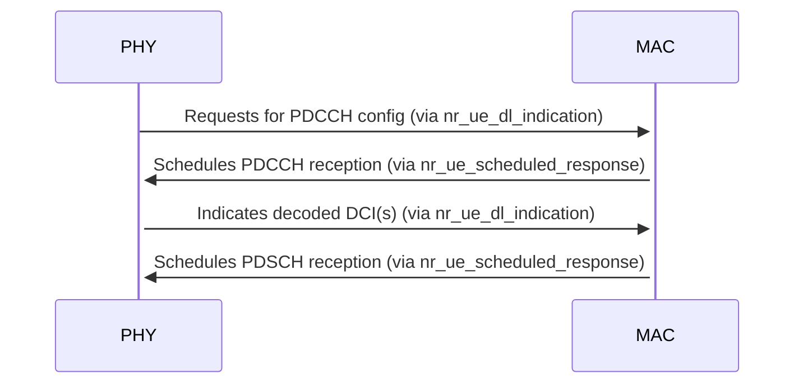
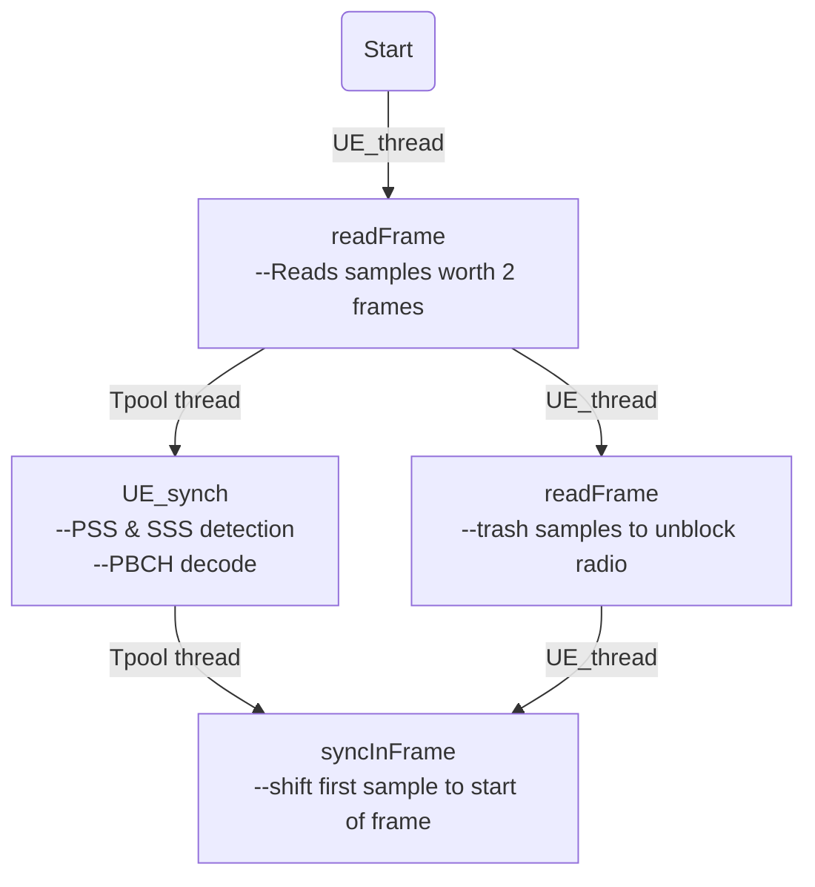
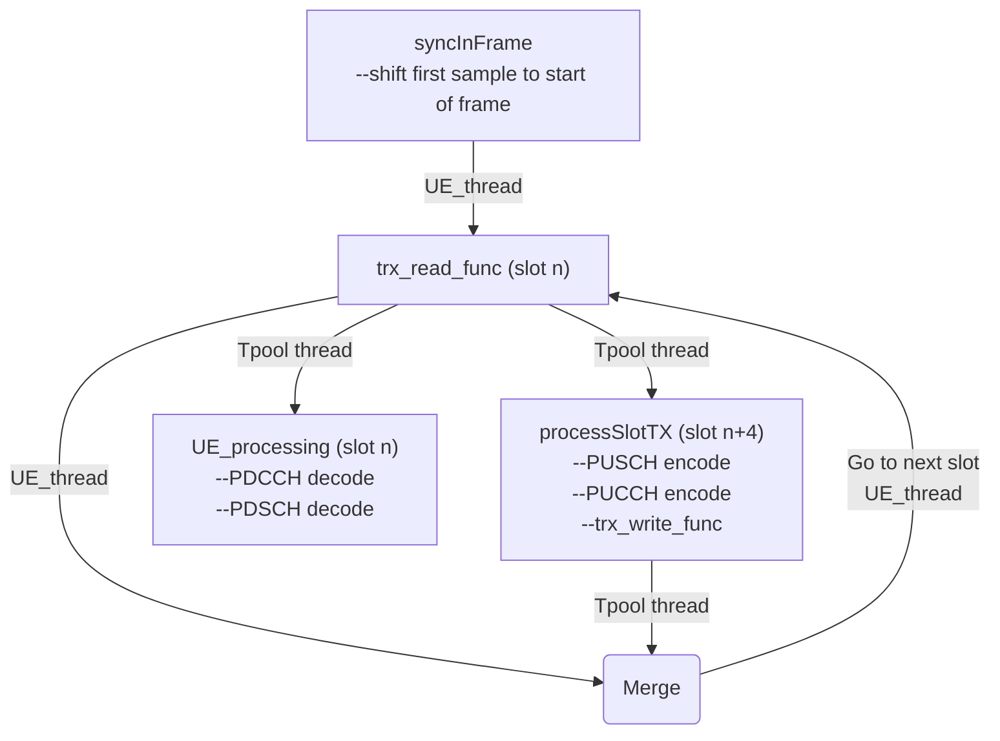

# PHY and MAC Interface
The PHY sends scheduling requests and data indication to MAC via `nr_ue_dl_indication` for DL path and `nr_ue_ul_indication()` for UL path and the MAC sends scheduling configuration to PHY via `nr_ue_scheduled_response()`. The following diagram shows the interaction for PDCCH and PDSCH reception.

# Multi-threading Design
The `UE_thread` function in `nr-ue.c` is the main top level thread that interacts with the radio unit. Once the thread spawns, it starts the 'Initial Synchronization'. Once its complete, the regular processing of slots commences.

The UE exits when at any point in operation it gets out of synchronization. When the command line option `--non-stop` is used, the UE goes to 'Initial Synchronization' mode when it loses synchronization with gNB. However, this feature is not fully implemented and it is a work in progress at the time of writing this documentation. This will be the default behavior (not a command line option) when the feature is fully implemented.

## Initial Synchronization Block

## Regular Slot Processing

