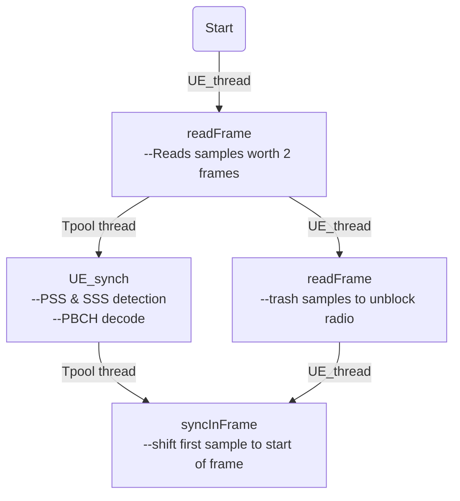
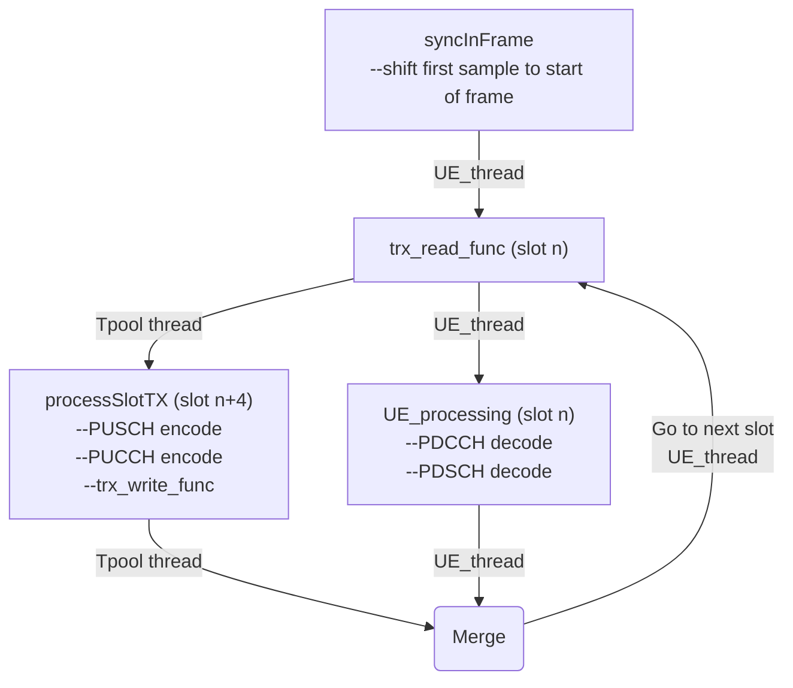

# Multi-threading Design
The `UE_thread` function in `nr-ue.c` is the main top level thread that interacts with the radio unit. Once the thread spawns, it starts the 'Initial Syncronization'. Once its complete, the regular processing of slots commences.

## Initial Syncronization Block

## Regular Slot Processing

