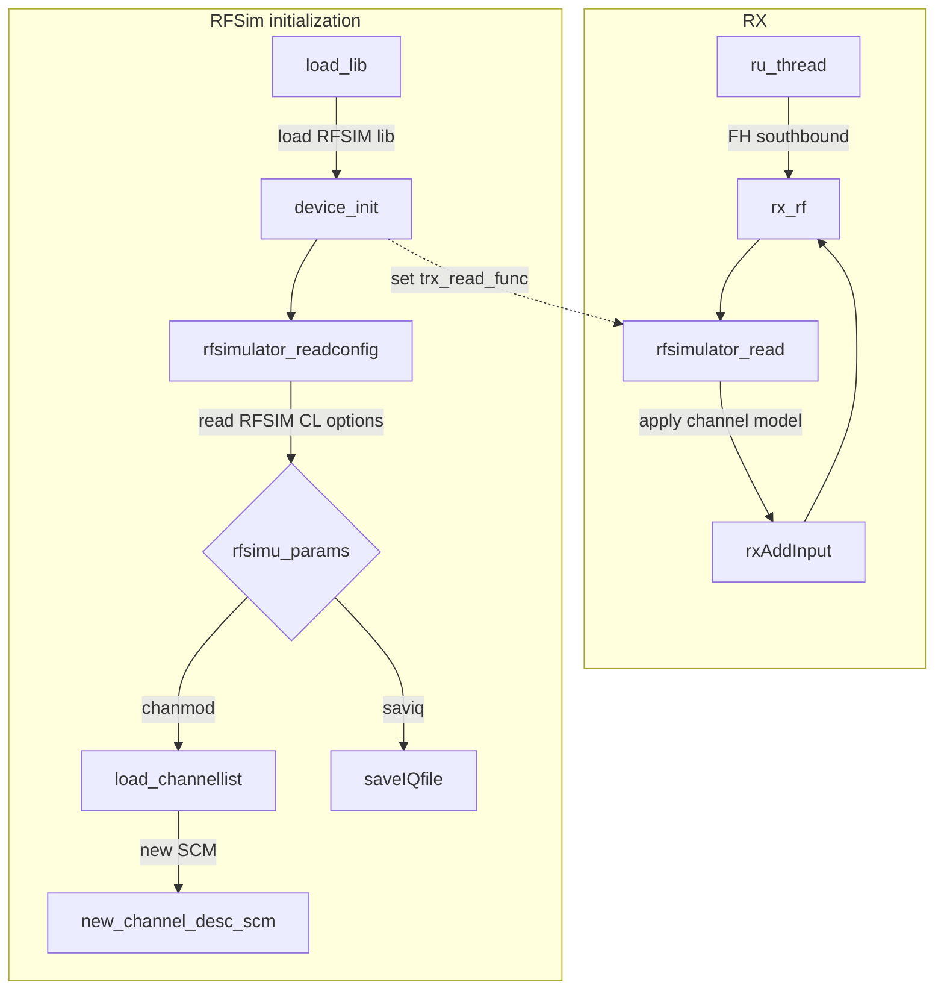

[[_TOC_]]

# General

This is an RF simulator that allows to test OAI without an RF board. It
replaces an actual RF board driver. In other words, towards the xNB/UE, it
behaves like a "real" RF board, but it forwards samples between both ends
instead of sending it over the air. It can simulate simple channels, such as
AWGN, hence it *simulates* RF.

As much as possible, it works like an RF board, but not in real-time: It can
run faster than real-time if there is enough CPU, or slower (it is CPU-bound
instead of real-time RF sampling-bound).

# Architecture

High-level flowchart of the RF Simulator, including the channel simulation feature:



# Build

## From [build_oai](../../../doc/BUILD.md) script
The RF simulator is implemented as an OAI device and always built when you build the OAI eNB or the OAI UE.

Using the `-w SIMU` option it is possible to just re-build the RF simulator device.

Example:
```bash
./build_oai --UE --eNB --gNB --nrUE --ninja -w SIMU
```

## Add the rfsimulator after initial build

After any regular build you can compile the device from the build directory:
```bash
cd <path to oai sources>/openairinterface5g/cmake_targets/ran_build/build
ninja rfsimulator
```

This is equivalent to using `-w SIMU` when running the `build_oai` script.

# Usage

## Overview

To use the RF simulator add the `--rfsim` option to the command line. By
default the RF simulator device will try to connect to host 127.0.0.1, port
4043, which is usually the behavior for the UE.  For the eNB/gNB, you either
have to pass `--rfsimulator.serveraddr server` on the command line, or specify
the corresponding section in the configuration file.

The RF simulator is using the configuration module, and its parameters are defined in a specific section called "rfsimulator". Add the following options to the command line in order to enable different RFSim features:

| CL option                       | usage                                                                          | default                |
|:---------------------           |:-------------------------------------------------------------------------------|----:                   |
|`--rfsimulator.serveraddr <addr>`| ip address to connect to, or `server` to behave as a tcp server                | 127.0.0.1              |
|`--rfsimulator.serverport <port>`| port number to connect to or to listen on (eNB, which behaves as a tcp server) | 4043                   |
| `--rfsimulator.options`         | list of comma separated run-time options, two are supported: `chanmod`, `saviq`| all options disabled   |
| `--rfsimulator.options saviq`   | store IQs to a file for future replay                                          | disabled               |
|`--rfsimulator.options chanmod`  | enable the channel model                                                       | disabled               |
|`--rfsimulator.IQfile <file>`    | path to a file to store the IQ samples to (only with `saviq`)                  | `/tmp/rfsimulator.iqs` |
|`--rfsimulator.wait_timeout`     | wait timeout when no UE is connected                                           | 1                      |

Please refer to this document [`SIMULATION/TOOLS/DOC/channel_simulation.md`](../../openair1/SIMULATION/TOOLS/DOC/channel_simulation.md) for information about using the RFSimulator options to run the simulator with a channel model.

## 4G case

For the eNB, use a valid configuration file setup for the USRP board tests and start the softmodem with the `--rfsim` and `--rfsimulator.serveraddr server` options.
```bash
sudo ./lte-softmodem -O <config file> --rfsim --rfsimulator.serveraddr server
```
Often, configuration files define the corresponding `rfsimulator` section, in
which case you might omit `--rfsimulator.serveraddr server`. Example:
```
rfsimulator : {
  serveraddr = "server";
};
```

For the UE, it should be set to the IP address of the eNB. For instance, if the
eNB runs on another host with IP `192.168.2.200`, do
```bash
sudo ./lte-uesoftmodem -C 2685000000 -r 50 --rfsim --rfsimulator.serveraddr 192.168.2.200
```
For running on the same host, only `--rfsim` is necessary.

The UE and the eNB can be used as if the RF is real. The noS1 mode might be used as well with the RF simulator.

If you reach 'RA not active' on UE, be careful to generate a valid SIM.
```bash
$OPENAIR_DIR/cmake_targets/ran_build/build/conf2uedata -c $OPENAIR_DIR/openair3/NAS/TOOLS/ue_eurecom_test_sfr.conf -o .
```

## 5G case

Similarly as for 4G, first launch the gNB, here in an example for the phytest:

```bash
sudo ./nr-softmodem -O ../../../targets/PROJECTS/GENERIC-LTE-EPC/CONF/gnb.band78.tm1.106PRB.usrpn300.conf --gNBs.[0].min_rxtxtime 6 --phy-test --rfsim --rfsimulator.serveraddr server
```

`--gNBs.[0].min_rxtxtime 6` is due to the UE not being able to handle shorter
RX/TX times.  As in the 4G case above, you can define an `rfsimulator` section
in the config file.

Then, launch the UE:

```bash
sudo ./nr-uesoftmodem --rfsim --phy-test --rfsimulator.serveraddr <TARGET_GNB_IP_ADDRESS>
```

Notes:

1. This starts the gNB and UE in the `phy-test` UP-only mode where the gNB is started as if a UE had already connected. See [`RUNMODEM.md`](../../doc/RUNMODEM.md) for more details.
2. `<TARGET_GNB_IP_ADDRESS>` should be the IP interface address of the remote host running the gNB executable, if the gNB and nrUE run on separate hosts, or be omitted if they are on the same host.
3. To enable the noS1 mode, `--noS1` option should be added to the command line, see again [`RUNMODEM.md`](../../doc/RUNMODEM.md).
4. To operate the gNB/UE with a 5GC, start them using the `--sa` option. More information can be found [here](../../../doc/NR_SA_Tutorial_OAI_CN5G.md).

## Store and replay

You can store emitted I/Q samples. If you set the option `saviq`, the simulator will write all the I/Q samples into this file. Then, you can replay with the executable `replay_node`.

First compile it like other binaries:
```bash
make replay_node
```
You can use this binary as I/Q data source to feed whatever UE or gNB with recorded I/Q samples.

The file format is successive blocks of a header followed by the I/Q array. If you have existing stored I/Q, you can adapt the tool `replay_node` to convert your format to the rfsimulator format.

The format intends to be compatible with the OAI store/replay feature on USRP.

## How to use OAI RFSIM with a channel model

Please refer to this document [`channel_simulation.md`](../../openair1/SIMULATION/TOOLS/DOC/channel_simulation.md) to get familiar with channel simulation in RFSIM and to see the list of commands for real-time usage with telnet.

# Caveats

There are issues in power control: txgain/rxgain setting is not supported.
